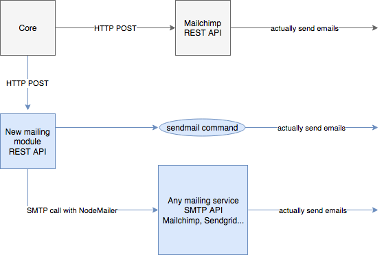

|              |                        |
| ------------ | ---------------------- |
| Author       | Thiébaud Modoux (Pryv) |
| Version      | 4 (03.04.2018)         |
| Distribution | Internally             |

# Adaptable and optional SMTP solution for Pryv

This document aims to go one step further in the design and implementation of an adaptable but optional SMTP solution for our Pryv installations.

The goal of such solution is to allow sending customizable emails when a new user is created on a Pryv core or when a user request a password reset for example.

We may resume here some elements that we already discussed in a [previous design draft](), which also contains a intermediary solution.

## Current situation

We currently use **[Mandrill](http://www.mandrill.com/)**, a transactional email API, to send emails to Pryv users who just registered or asked for lost password.

Such solution implies that we enforce our customers who install a Pryv instance to use this service and we limit them to the usage of Mandrill. Indeed, some customers may want to:

* Deactivate this service; for example, customers who will administrate users outside Pryv.
* Use their own solution for this service, it can be Mandrill or any other similar solution.
* Use a ready-to-use solution but to be able to customize this service, by providing email templates for example.

Note that we already implemented configuration flags to allow the deactivation of emails (welcome emails, or reset-password emails, or both).

Still, we currently can not satisfy all the customer needs with our current approach.

## Scope and deliverables

We are listing here the parts of Pryv.io that are going to be affected by the implementation we propose below, as well as the new parts that will be delivered.

Since our main goal is to extract the mailing features from service-core into a new external module, the impact on current implementation will basically be changes in service-core/api-server and a new module serving the extracted mailing features.

### Changes in pryv.io/service-core/api-server

In account methods of service-core/api-server, the [sendPasswordResetMail](https://github.com/pryv/service-core/blob/release-1.3/components/api-server/src/methods/account.js#L91) function, as well as the [sendWelcomeMail](https://github.com/pryv/service-core/blob/release-1.3/components/api-server/src/methods/system.js#L62) function in system methods will be modified so that they can POST to the new mailing module if the configuration ask for.

By default, we will keep the current POST to Mailchimp untouched, as well as the possibility to disable email sending through configuration flags. Switching between Mailchimp and the new mailing module will be done by specifiying the endpoint URL in the [emails configuration](https://github.com/pryv/service-core/blob/release-1.3/components/api-server/config/production.json#L41).

In short, these changes will generate a new release of service-core.

### New mailing module

The new mailing module will consist of an external Node REST API, packaged as an additional docker container. It will have its own configuration and will be running alonside service-core.

## Implementation proposition

### Overview

First of all, we want to keep the current functionalities of service-core untouched, i.e. the configuration flags to deactivate emails and the interaction with Mailchimp RESTful API will stay as it is now.

We will build a new external module that will serve as mailing service, also through a RESTful API. It will be implemented using [Nodemailer](https://nodemailer.com/about/) and [Email-templates](https://github.com/niftylettuce/email-templates).

The module instanciates a **Transporter** to either directly send emails using sendmail command or delegate this task to an external service such as Mailchimp.

**Emails** are created and customized thanks to templating and then piped to the transport layer. For now, we want to be able to send welcoming emails for new user and password reset emails.

Our basic API will expose one route for each type of email, namely /welcome and /reset, on which service-core will be able to POST to trigger the sending of emails.
Parameters for these requests are the user langage (context.user.langage in core) and a mapping of variables to be substituted in the email, depending on email type:

- Welcome: user email, username
- Reset-password: user email, username, passwordResetPageURL, resetToken

### Transporter object

The Transporter defines the strategy used to deliver the emails.
It will be configurable through **transport options** that are read from the configuration file.

We plan two different types of transport:

#### 1) SMTP transport

SMTP is the main transport in Nodemailer for delivering messages. SMTP is also the protocol used between different email hosts, so its truly universal.

Looking at some of the [most used transactional email service providers](https://mailbakery.com/blog/transactional-email-service-providers/),
we can see that most of them supports SMTP based sending:

* [Mailchimp](https://mandrill.zendesk.com/hc/en-us/articles/205582127-How-to-Use-the-SMTP-Integration-with-Popular-Web-Frameworks)
* [Sendgrid](https://sendgrid.com/docs/API_Reference/SMTP_API/building_an_smtp_email.html)
* [AWS SES](https://docs.aws.amazon.com/ses/latest/DeveloperGuide/send-an-email-using-smtp.html)
* [SendinBlue](https://apidocs.sendinblue.com/sendin-smtp)

This transport can be configured through the following **transport options**:
  - **host**: hostname of the SMTP server
  - **port**: port of the SMTP server
  - **username** and **password**: authentication data

#### 2) Sendmail transport

An alternative is to pipe our Transporter to the standard input of the sendmail command (similar to the use of the mail() function in PHP).

Using this type of transport requires to provide the following **transport options**:
- **sendmail**: set it to _true_ to activate sendmail transport
- **newline**: defines the newlines syntax, either ‘windows’ or ‘unix’ (default)
- **path**: path to the sendmail command (eg: '/usr/sbin/sendmail')

### Email object

We will use [Email-templates](https://github.com/niftylettuce/email-templates) to instantiate **Email** objects. It will allow to fully customize emails using any of the popular template engine; we go for Pug here.

Here is the basic structure of an Email:

- **from**: sender address, configurable at start through configuration file
- **to**: recipient address, refers to the Pryv user, provided by api-server
- **subject**: subject of the email, customizable
- **text**: plaintext version of the message, customizable
- **html**: HTML version of the message, customizable

The template engine (Pug) will be in charge of rendering the email's content, i.e. **subject**, **text** and **html**.

By default, we propose to use our own templates:
  - _emails/welcome/subject.pug_
  - _emails/welcome/text.pug_
  - _emails/welcome/html.pug_
  - _emails/password/subject.pug_
  - _emails/password/text.pug_
  - _emails/password/html.pug_

Moreover, we will support multi-langages emails by searching in sub-folders such as _emails/welcome/fr/html.pug_.

These files can be easily customized by our clients, we will document how. From a Docker point of view, we will have to make these files modifiable from outside the container.

## Extension propositions

### Abandon Email shape

Since we're now probably more often than not POSTing emails to a third-party service (email module), we might consider changing the 'email' (e.g. user's email address) fields to something more generic, such as 'externalUserId'.

Doing so, a third-party implementation might use some other mechanism of alerting the user, in place of email sending, and store the necessary id in this new field.

### Prevent from abuse

We have to think about a way to authenticate/bind service-core against/with the mailing module, so that we avoid any situation where somebody could abuse of the mailing API to send unauthorized emails.

The first solution we will go for is a key shared between service-core and service-mail, service-core will send the key in each request (Authorisation header) and service-mail will check against it's own key.

### Missing templates

In the case where a template is missing, we have to plan how we fallback.
If there is no available template at all, then the app will throw an error.
If the requested language is not available, then the app may choose another template: english by default or any other available.
If some substitution variables are mentioned in the template but are not provided by service-core, then we have to throw an error as well.