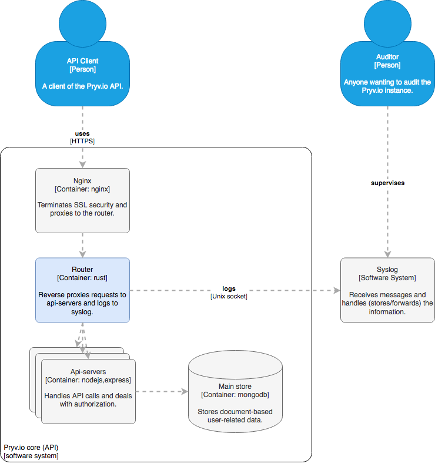
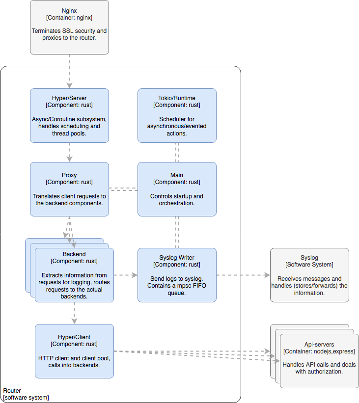

|         |                       |
| ------- | --------------------- |
| Author  | Thiébaud Modoux 	    |
| Date    | 04.03.2018            |
| Version | 1                     |


Audit capabilities for Pryv.io
{: .doc_title} 

Audit and security log MVP
{: .doc_subtitle} 

# Summary

We implement auditing capabilities for Pryv.IO by replacing the current nginx-based Proxy/Router container with a separate SSL Terminator (based on nginx) and a Router (based on custom code). From that Router, we inspect both API requests and responses and log them to the syslog.

# Requirements and goals

Our main goal is to implement auditing in Pryv.IO as defined by this definition (Wikipedia):
An audit trail (also called audit log) is a security-relevant chronological record, set of records, and/or destination and source of records that provide documentary evidence of the sequence of activities that have affected at any time a specific operation, procedure, or event. [...]

Paraphrasing this for Pryv.IO, we want to implement the following:
Pryv.IO Audit Log logs all actions executed against Pryv.IO API. The Pryv.IO Security Log logs all failed actions, such as authentication and authorisation failures. Both type of log will be written to the syslog mainly and is intended for performing audits.

To achieve these goals, we introduce a new Router component, which will have the following features:

- Audit Log will contain logs of all successful calls.
- Security Log will contain logs of all unsuccessful calls.
- All log entries are sent to the syslog in an unstructured manner.
- Structured logging will require to rely on additional unix tools. We will provide a few presets.
- A reasonable amount of concurrent requests per second need to be handled: 5k - 10k rqps
- A small delay between the action that is being logged and it appearing in the log is acceptable. O(5min)

We decided early on to use the Unix syslog for storing audit information; we refer to the large list of specialised syslog audit tools as justification for this decision. We also believe that our client's system administrator will already know how to audit the security logs for breaches.

This document contains a design for a first security and audit log implementation. Our aim here is not completeness, but trying to keep project time short. Given this constraint it will be acceptable to make compromises with regards to completeness. We foresee that we will need to implement a second phase if the feature is successful.

## Limitations

We simplify the router component by reducing it to simply forward messages to a single set of backend servers randomly. This simplification is shown in the Architecture section and means that we don't have to route requests yet, just forward them.
Router will be simple in other aspects as well; it will not initially contain any of the features found in outer routers such as hot-upgradability or status observability. This is not essential here and will get added later on.

We limit the Router to proxy the HTTP protocol only; the Websockets protocol will not work and will need to be routed to the backends directly. Very few clients use the Websockets protocol for anything else but to get notified of changes in Pryv.IO, so limiting ourselves to HTTP will not impact the usefulness.

Performance will entirely left to the design, we will not test it in this phase. We eventually want a system that is performant from start to finish, however we first need a system that has the right features.

# Architecture

As proposed in the earlier architecture document, we will use a Router component to intercept calls and log security information; this can be seen in the Pryv.IO core diagram:



(The above diagram doesn't depict all containers that make up a Pryv.IO system, only a subset useful for the current design).

We will split the current 'SSL Termination and Router' container into two parts. One part will terminate SSL and proxy to the router. We will continue to deliver our base installation including nginx for this purpose; but the configuration will be a bit simpler.

The other part is where the work happens for the present feature: it gets a HTTP request as input, parses it, routes it to an api-server and processes the HTTP answer for sending it to the client. All requests transit this component: It can easily detect security relevant situations and log the necessary details about the requestor and the request to the syslog.

# Router design

The Router is a possibly multi-threaded program written in the Rust programming language. We will use the coroutine/tokio style for writing this program; the task at hand is heavily parallel and will profit from lightweight tasks and cooperative multitasking. Inside the Router, we can find the following components:



The Main component deals with application startup, cli arguments parsing and producing all the rest of the system and linking it up.

The Tokio/ Runtime subsystem deals with asynchronous IO and coroutines and provides promise support to the rest of the code. Most of the complexity is abstracted away in this layer; the code is automatically distributed among several threads in a pool and IO is handled for us.

The Proxy system handles each client request as it comes in. It chooses the Backend to call for serving the request and delegates request handling to that Backend.

The Backend routes requests to the right backend and deals with the answer, sending it to the Router client.
Eventually, this layer will handle load balancing and interception. The Backend also inspects the (Request, Response) tuple and sends information about the calls to the Syslog Writer for logging.

The Syslog Writer maintains the connection with the syslog device through Unix socket and transits log entries through a multi-producer, single-consumer FIFO queue. It also wraps the log entries into their final format, especially by hashing the authorization tokens. The hashing strategy uses Scrypt and hashes are memoized in a LRU cache.

The Hyper/ Client subsystem helps with calling backends and obtaining their response. Luckily, the Hyper library has great coherence between the client and the server role, allowing the code to be simple here yet perform many actions out of the box. The client library already does keep-alives and pooling; the facilities provided might not be enough, but in the interest of keeping the MVP small, we will not touch this part for now and stick to the defaults provided.

## Syslog protocol and management

The Syslog protocol (https://en.wikipedia.org/wiki/Syslog) is a de-facto standard that can be used to transmit messages to the system for filtering/ forwarding or simply storage in a file.

The router logs to the docker container syslog directly by writing to '/dev/log'. Our configuration will mount the hosts '/dev/log' as the containers '/dev/log' - messages will get written to the host syslog directly.

Our clients must configure a destination for these messages by using either log shipping methods (logstash, etc...) or by configuring rsyslogd to ship messages elsewhere. They can also analyse the messages in place using the plethora of specialised unix tools.

## Message format

The following metadata will be present in all action related messages:

| Name              | Typical Value                                 | Description                         |
| ------------------- | ------------------------------------------- | ------------------------------- |
| timestamp     | 'Feb 21 13:42:28'                     | Date and time at which the operation was attempted                      |
| host     | 'co1-pryv-li'                     | Hostname of the targeted machine                      |
| process name     | 'pryvio_core'                     | Name of the router process intercepting the operation                      |
| forwarded_for     | '172.18.0.8:40994'                     | IP addresses making the request                      |
| username        | 'testuser'          | User account that is being accessed            |
| authorization_hash, auth_hash     | Hashed value       | Encrypted token that was used to make the call (see next section)       |
| action   | 'GET /profile/private'     | HTTP verb and API route identificating the attempted operation |
| status        | 403           | HTTP status of the server response                    |
| error_id        | 'invalid-access-token'           | Pryv.io error code associated with the security exception                    |
| error_message        | 'Cannot find access from token.'           | Message indicating the source of the problem, often formatted by the backend.                    |
| query        | 'n/a'           | The query parameters associated with the request, if any.                    |

The syslog can only receive a single line of text that is at maximum 1024 bytes long. A single-line JSON string of the above message is around 350 bytes long. Considering that we'll not log the 'error_message' field as part of structured data (since it will be logged as part of the unstructured human-readable data), the size limit should not worry us in general.

Here's the proposed format for logging the above:

```
Feb 21 13:42:28 co1-pryv-li pryvio_core[1]: 403: Cannot find access from token. Details: {"forwarded_for":"172.18.0.8:40994","action":"GET /profile/private","error_id":"invalid-access-token","username":"testuser","query":"n/a","authorization_hash":"$rscrypt$0$DwgB$s9lik0ueUeJ7WxO1ilzbTA==$ySEgViYtOOuKRw+Q+XcfWjk/GMKVRzA1Oz0PbodFXRs=$"}
```

### Special cases

Details about a batch call cannot be inferred from the action / the path alone; logging only the fact that a batch call has happened isn't useful. To handle batch calls for the purposes of the audit log, we need to analyse at least the batch response, looking at each batch item.

Ideally, we would also capture system startup and shutdown. At least the router process will log these events for now, indicating perhaps a shutdown/reboot of the whole system. In time, all components should log these kind of messages.

### Privacy discussion

The token should ideally not be visible to the security officer; neither should it be written to the syslog. It represents an access authorisation and must be kept secret. Instead of the token, we will log a salted hash of the token instead in this first iteration. This has the advantage of being uniquely associated to the actual token while still being hard to reconstruct. We might later switch to using token ids from the metadata database; this approach has the disadvantage of needing a database lookup.

We are aware that messages logged to the Syslog involve a privacy tradeoff. On one side, we protect the privacy of the user data by logging attempts to compromise it. On the other side, we might be compromising that very privacy by logging too much detail in our messages. This needs to be handled on a case-by-case basis, here are a few general guidelines:
- We protect the data owners privacy, not the attackers. Failed requests (especially those in the 403 range) can be reported with some detail.
-  A request failure might happen accidentally, i.e. the data owner mistypes his password. The exact password used is thus private data, even in failed requests. Other requests might fall into this category.
We chose the syslog as a readily available destination for these log messages. The downside of using the syslog is that it is not structured in any way; the only useful structure it has is being able to log a timestamp. To log a list of fields like the above, one would naturally choose a structured text format such as JSON.

### Authorisation token encryption

Audit entries will be logged along with authorisation tokens that were used to provoke them. We cannot however log the token itself - it would be far too easy to steal data this way. Even if we assume that the audit log is only looked at by qualified personnel, we would be making abuse too easy. Instead, we decided to store an 'scrypt' hash of the token in the security log. This hash is computed and then cached for the lifetime of the router process (RAM).

Given this algorithm, a security officer can:

- Verify at a glance if a second attack comes from the same 'person' as the first one. Since hashes stay the same during a period of time, comparing hashes is sufficient for this.
- Find the actual token that the hash refers to by encrypting all the user's tokens with the given salt. The matching hash will correspond to the matching token. If no token matches, then the token has either been deleted or it has never matched an existing token.
  
We chose to store the state that allows decrypting the tokens in the log itself ('salt'), because it is simple to implement and provides a reasonable amount of security.

## Error handling

There are several places where a proxied request can fail, e.g:

- Backend can die and not answer to any requests anymore. Subsequent requests will time out.
- The request to the backend can take a long time. The router needs to have some way of timing out
the request and informing the client.
- The client can disappear during the request handling.
- During the request to the backend, a 'client' error occurs.

The router needs to handle these conditions and reflect the state of the request to the client.

We will apply the following strategies:

### Backend timeout

If the backend takes a long time (> backend_timeout seconds), we will return a gateway error (504, Gateway Timeout) to the client.

### Dead backend

A backend can die in one of two ways: It either crashes completely, tearing down all resources and closing its listening socket or it can get stuck in a loop and just not answer anymore. The second option is handled by client timeouts on the backend connection.
If the backend has become unavailable, the future returned by 'client.request' will resolve to an error. We catch this error and transform it into a '503 Service Unavailable' error to return to the router client.

### Other client errors

If during the request to the backend the 'request' future rejects with an error, we need to catch that error and return it to the client in the form of an error response. Unknown errors will be mapped as '502 Bad Gateway' errors.
