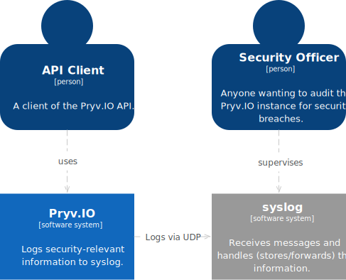
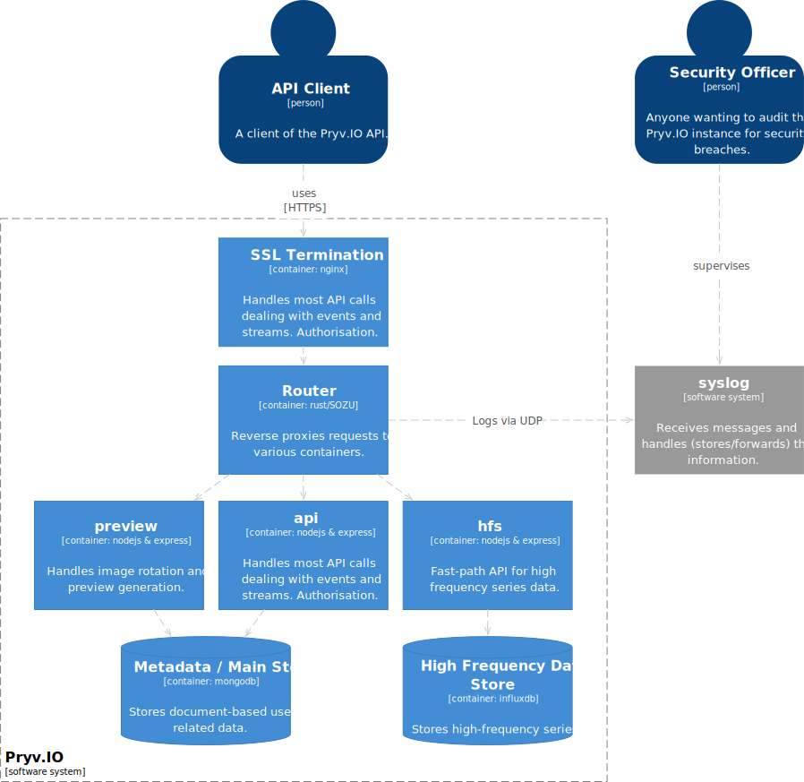
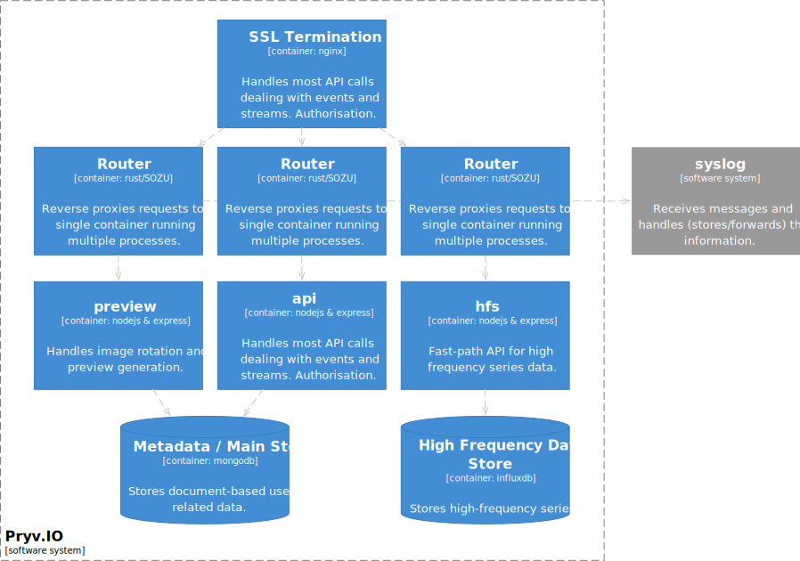
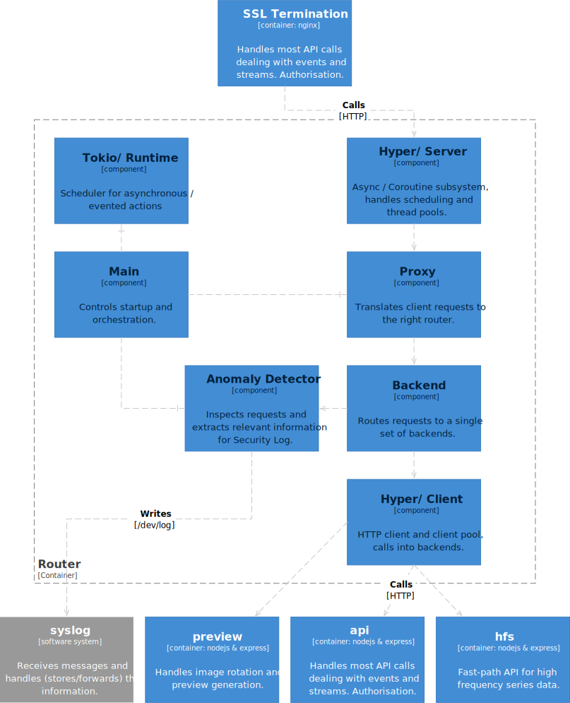

|         |                                  |
| ------- | -------------------------------- |
| Author  | Kaspar Schiess (kaspar@pryv.com) |
| Version | 4 (20180822)                     |


Security Log 
{: .doc_title } 

Phase I: MVP 
{: .doc_subtitle} 

# Summary

This is the design document for the second phase of the project described in 'Audit Log/00-architecture_and_plan'. It describes the first implementation of the new security log. As outlined in the overarching document, we aim for a quick implementation that takes shortcuts but can be demonstrated. 

We implement the Security Log by replacing the current nginx-based Proxy/Router container with a separate SSL Terminator (based on nginx) and a Router (based on custom code). From that Router, we detect failures that are relevant and log them to the syslog. 

The plan foresees around 19 days of effort. Once started, this project will take us about 5 weeks from start to finish. 

| Version | Change                                                       |
| ------- | ------------------------------------------------------------ |
| 1       | Initial Draft.                                               |
| 2       | Removed SOZU as a technology; revised message format, CLI interface and documented component organisation. |
| 3       | Document research around client pooling; Improved the component diagram for the Router. |
| 4       | Added a section on backend error handling.                   |


------

# Goals and Scope

As part of our larger 'Audit Log' initiative, we'd like to create a dedicated Security Log for Pryv.IO that receives all security relevant information. The document '00-requirements' contains the requirements for the Security Log; to sum up, our goal is: 

> Create a Log that receives security-related information about a running Pryv.IO instance in near-realtime. 

We decided early on to use the Unix syslog for storing this information; we refer to the large list of specialised syslog audit tools as justification for this decision. We also believe that our client's system administrator will already know how to audit the security log for breaches. 

This document contains a design for a first security log implementation. Our aim here is not completeness, but trying to keep project time short. Given this constraint it will be acceptable to make compromises with regards to completeness. We foresee that we will need to implement a second phase if the feature is successful. 

## Scope Limitations

We simplify the router component by *reducing it to simply forward messages to a single set of backend servers randomly*. This simplification is shown in the Architecture section and means that we don't have to route requests yet, just forward them. 

Router will be simple in other aspects as well; it will not initially contain any of the features found in outer routers such as hot-upgradability or status observability. This is not essential here and will get added later on. 

We limit the Router to *proxy the HTTP protocol only; the Websockets protocol will not work* and will need to be routed to the backends directly. Very few clients use the Websockets protocol for anything else but to get notified of changes in Pryv.IO, so limiting ourselves to HTTP will not impact the usefulness. 

Performance will entirely left to the design, we will not test it in this phase. We eventually want a system that is performant from start to finish, however we first need a system that has the right features. 

# Architecture

Even within this reduced scope, we will use the architecture laid out in '00-architecture_and_plan' as a basis. Here's a system overview (a system is something that delivers value to its users, see [c4 model](https://c4model.com/)) within the context of a security log:

{: style="width: 10cm"}



As proposed in the earlier architecture document, we will use a Router component to intercept calls and log security information; this can be seen in the Pryv.IO container diagram: 



(The above diagram doesn't depict all containers that make up a Pryv.IO system, only a subset useful for the current design). 

We will split the current 'SSL Termination and Router' container into two parts. *One part* will only terminate SSL; this can be removed from Pryv.IO by the client and handled by a web application firewall appliance (for example). We will continue to deliver our base installation including nginx for this purpose; but the configuration will be radically simpler and only involve SSL termination. 

The *other part* is where the work happens for the present feature: it gets a HTTP request as input, parses it, routes it to the right backend and processes the HTTP answer for sending it to the client. All requests transit this component: It can easily detect security relevant situations and log the necessary details about the requestor and the request to the syslog. 

Our first implementation will look like this: 



By deploying multiple 'router' containers each responsible for a single set of backend processes, we keep the actual routing in nginx and don't need to worry about implementing this part for now. The syslog protocol serialises messages for us; a concern that will have to be addressed in the audit log, but can be left out for now. 

# Use Cases

## #1 Overarching Usage

1. The User makes an API request. 
2. As part of the operation, a security problem arises. The Pryv.IO System logs relevant details to the Syslog. 

# Design

## Router Overview

The router is a possibly multi-threaded program written in the Rust programming language. We will use the coroutine/tokio style for writing this program; the task at hand is heavily parallel and will profit from lightweight tasks and cooperative multitasking. 

We choose this technology over NodeJS mainly for performance reasons. NodeJS is still a single-threaded runtime environment; even if we were to parse and handle a request quickly and in an asynchronous manner, we would design with a hard barrier in mind after which a complicated multi-process system would be needed to scale up. Routing Pryv.IO requests will involve some state; Logging these requests in a serial manner also does. To coordinate this state across several NodeJS instances, we'd be incurring a lot of accidental complexity. 

We will build the router as a [12-factor-app](https://12factor.net/) as far as possible.

## Router Components




The **Main** component deals with application startup, cli arguments parsing and producing all the rest of the system and linking it up. 

The **Tokio/ Runtime** subsystem deals with asynchronous IO and coroutines and provides promise support to the rest of the code. Most of the complexity is abstracted away in this layer; the code is automatically distributed among several threads in a pool and IO is handled for us. 

The **Proxy** system handles each client request as it comes in. It detects the *Backend* to call for serving the request and delegates request handling to that *Backend*. In the MVP, there will always be a single (set of) backend(s) per *Proxy*.

The **Backend** routes requests to the right backend and deals with the answer, sending it to the Router client. 

Eventually, this layer will handle load balancing and interception, so it will grow in size; in the first version, we will just handle load balancing to a single set of backend servers here, everything else remains with nginx for now. 

The **Anomaly Detector** inspects the (Request, Response) tuple and writes to the syslog of the docker component if a relevant action has happened. 

The **Hyper/ Client** subsystem helps with calling backends and obtaining their response. Luckily, the Hyper library has great coherence between the client and the server role, allowing the code to be simple here yet perform many actions out of the box. 

The client library already does keep-alives and pooling; the facilities provided might not be enough, but in the interest of keeping the MVP small, we will not touch this part for now and stick to the defaults provided. 

## Syslog Protocol & Management

The [Syslog protocol](https://en.wikipedia.org/wiki/Syslog) is a de-facto standard that can be used to transmit messages to the system for filtering/forwarding or simply storage in a file. 


For our purposes, we will use the following facility codes: 

| Facility code | Keyword | Description                     |
| ------------- | ------- | ------------------------------- |
| 1             | user    | user-level messages             |
| 4             | auth    | security/authorization messages |

Messages should use the appropriate severity code as shown by this table: (a subset of what Wikipedia shows)

| Value | Severity      | Description                       | Condition                                                    |
| ----- | ------------- | --------------------------------- | ------------------------------------------------------------ |
| 0     | Emergency     | System is unusable.               | A panic condition.[8\](/Pryv.IO%20former%20wiki/8\.md)(https://en.wikipedia.org/wiki/Syslog#cite_note-opengroupSyslog-8) |
| 1     | Alert         | Action must be taken immediately  | A condition that should be corrected immediately, such as a corrupted system database.[8\](/Pryv.IO%20former%20wiki/8\.md)(https://en.wikipedia.org/wiki/Syslog#cite_note-opengroupSyslog-8) |
| 2     | Critical      | Critical conditions               | Hard device errors.[8\](/Pryv.IO%20former%20wiki/8\.md)(https://en.wikipedia.org/wiki/Syslog#cite_note-opengroupSyslog-8) |
| 3     | Error         | Error conditions                  |                                                              |
| 4     | Warning       | Warning conditions                |                                                              |
| 5     | Notice        | Normal but significant conditions | Conditions that are not error conditions, but that may require special handling.[8\](/Pryv.IO%20former%20wiki/8\.md)(https://en.wikipedia.org/wiki/Syslog#cite_note-opengroupSyslog-8) |
| 6     | Informational | Informational messages            |                                                              |
| 7     | Debug         | Debug-level messages              | Messages that contain information normally of use only when debugging a program.[8\](/Pryv.IO%20former%20wiki/8\.md)(https://en.wikipedia.org/wiki/Syslog#cite_note-opengroupSyslog-8) |

We use the severity code as intended to indicate possible actions that need to happen. 

The router logs to the docker container syslog directly by writing to '/dev/log'. Our configuration will mount the hosts '/dev/log' as the containers '/dev/log' - messages will get written to the host syslog directly. 

Our clients must configure a destination for these messages by using either log shipping methods (logstash, etc...) or by configuring rsyslogd to ship messages elsewhere. They can also analyse the messages in place using the plethora of specialised unix tools. 

## Message Format

The following metadata will be present in all action related messages: 

| Name          | Typical Value                                                | Description                                                  |
| ------------- | ------------------------------------------------------------ | ------------------------------------------------------------ |
| forwarded_for | '127.0.0.1,192.16.8.1'                                       | IP addresses making the request. The first IP address indicates where the request originated. |
| username      | 'jsmith'                                                     | User account that is being accessed.                         |
| token         | 'cji5os3u11ntt0b40tg0xhfea'                                  | The token that was used to perform the action.               |
| action        | 'GET'                                                        | HTTP verb used in the transaction                            |
| path          | '/events'                                                    | Together with the action field identifies the attempted operation. |
| status        | 403                                                          | HTTP status of the server response.                          |
| error_id      | 'invalid-access-token'                                       | Pryv.IO error code associated with the security exception.   |
| error_message | 'The access token is missing: ... or an \"auth\" query string parameter." | Message indicating the source of the problem, often formatted by the backend. |

The syslog can only receive a single line of text that is at maximum 1024 bytes long. A single-line JSON string of the above message is around 300 bytes long. Considering that we'll not log the 'error_message' field as part of structured data (since it will be logged as part of the unstructured human-readable data), the size limit should not worry us in general. Here's the proposed format for logging the above: 

```
Aug  3 14:52:01 core API[123433]: (GET /events) The access token is missing: expected an \"Authorization\" header or an \"auth\" query string parameter. Details: {"forwarded_for":"127.0.0.1,192.16.8.1","username":"jsmith","token":"cji5os3u11ntt0b40tg0xhfea","status":403,"error_id":"invalid-access-token"}
```

The detailed structured part of the message omits these fields: 'action', 'path', 'error_message'. All of these are represented elsewhere in the log line; considering our space constraints, we opt to not store the information twice. 

### Special Cases

Details about a **batch call** cannot be inferred from the action / the path alone; logging only the fact that a batch call has happened isn't useful. To handle batch calls for the purposes of the security log, we need to analyse at least the batch response, looking for security violations. The associated message should indicate that the exception happened as part of a larger batch call. 

Ideally, we would also capture **system startup and shutdown** in the security log. At least the router container will log these events for now, indicating perhaps a shutdown/reboot of the whole system. In time, all components should log these kind of messages. 

### Discussion

The **token** **should** ideally **not be visible** to the security officer; neither should it be written to the syslog. It represents an access authorisation and must be kept secret. Instead of the token, we will log a salted hash of the token instead in this first iteration. This has the advantage of being uniquely associated to the actual token while still being hard to reconstruct. We might later switch to using token ids from the metadata database; this approach has the disadvantage of needing a database lookup. 

We are aware that messages logged to the Syslog involve a **privacy tradeoff**. On one side, we protect the privacy of the user data by logging attempts to compromise it. On the other side, we might be compromising that very privacy by logging too much detail in our messages. This needs to be handled on a case-by-case basis, here are a few general guidelines: 

* We protect the data owners privacy, not the attackers. Failed requests (especially those in the 403 range) can be reported with some detail. 
* A request failure might happen accidentally, i.e. the data owner mistypes his password. The exact password used is thus private data, even in failed requests. Other requests might fall into this category. 

We **chose the syslog** as a readily available destination for these log messages. The downside of using the syslog is that it is **not structured in any way**; the only useful structure it has is being able to log a timestamp. To log a list of fields like the above, one would naturally choose a structured text format such as JSON. 

If a candidate **message is bigger than the allowed 1024 bytes**, it needs to be shortened. To do so, we format the message and then cut off as many characters as needed off the right side. As a consequence, the JSON part of the message will not be easy to parse for these messages. This is a first simple approach that can certainly be improved. 

## Error Handling

There are several places where a proxied request can fail, e.g: 

* Backend can die and not answer to any requests anymore. Subsequent requests will time out. 
* The request to the backend can take a long time. The router needs to have some way of timing out the request and informing the client. 
* The client can disappear during the request handling. 
* During the request to the backend, a 'client' error occurs.

The router needs to handle these conditions and reflect the state of the request to the client. We will apply the following strategies: 

#### Backend Timeout

If the backend takes a long time (> `backend_timeout` seconds), we will return a gateway error (504, Gateway Timeout) to the client. 

Code like this (by [Sergey Potapov on Stackoverflow](https://stackoverflow.com/questions/45313119/how-to-set-timeout-for-http-request-with-hyper-tokio-and-futures-in-rust)) will allow setting and dealing with a client timeout: 

```rust
let timeout = tokio_core::reactor::Timeout::new(Duration::from_millis(170), &handle).unwrap();

let work = request.select2(timeout).then(|res| match res {
    Ok(Either::A((got, _timeout))) => Ok(got),
    Ok(Either::B((_timeout_error, _get))) => {
      Err(hyper::Error::Io(io::Error::new(
        io::ErrorKind::TimedOut,
        "Client timed out while connecting",
      )))
    }
    Err(Either::A((get_error, _timeout))) => Err(get_error),
    Err(Either::B((timeout_error, _get))) => Err(From::from(timeout_error)),
});
```

#### Dead Backend

A backend can die in one of two ways: It either crashes completely, tearing down all resources and closing its listening socket or it can get stuck in a loop and just not answer anymore. The second option is handled by client timeouts on the backend connection. 

If the backend has become unavailable, the future returned by '`client.request`' will resolve to an error. We catch this error and transform it into a '503 Service Unavailable' error to return to the router client. 

#### Other Client Errors

If during the request to the backend the 'request' future rejects with an error, we need to catch that error and return it to the client in the form of an error response. Unknown errors will be mapped as '502 Bad Gateway' errors. 

## CLI Interface

The router has a CLI interface that allows starting it on a given port and delegating calls made to it to a list of backend ports. Here's the general usage information: 

```shell
$ router [OPTIONS]
```

To forward requests to the ports 4000, 4001, 4002, 4003 also on 127.0.0.1, one would call it like so: 

```shell
$ router -b :4000 -b :4001 -b :4002 -b :4003
```

As a special case, we need the address '0.0.0.0' to bind to all local interfaces. 

We implement these command line switches: 

| Switch                         | Meaning                                                 |
| ------------------------------ | ------------------------------------------------------- |
| -b (--backend) BACKEND_ADDRESS | Add a backend to serve requests to.                     |
| -d (--debug)                   | Verbose operation; also logs syslog messages to stdout. |

## Logging

The router logs the following events (unless in verbose mode):

* Startup (Timestamp, Version)
* Shutdown (Timestamp, Version)
* Warnings about the HTTP traffic it sees, anomalies and parse failures. 
* Able/Unable to bind to the target interface (at startup).
* Backend not reachable. 

These logs allow debugging the router. 

# Tests

The main artefact we describe here routes requests to other processes using HTTP and then parses both request and response, extracts details and logs to syslog. To test such a container, we will need to simulate the whole interaction. We propose - as a first approach to this - the following two test setups: 

* Automatic Tests: Using a NodeJS test driver, we will start both the Router and a fake backend process. We will then make requests through the router and observe the effects on the syslog. 
* Manual Tests: We will create a test script that can be used to manually produce the different effects in the syslog using a local build of Pryv.IO as a basis. 

## Automatic Tests

Here's a list of situations that will be tested in automated fashion: 

* Login Failure produces syslog message. 

Related to proxy operation and backend failures: 

* Backend takes longer than 'backend_timeout' seconds to answer. We should receive a '504 Gateway Timeout' error. 
* Backend doesn't answer to connections. We should receive a '503 Service Unavailable' error. 
* Hard to test, so maybe skip this: Other errors should yield a '502 Bad Gateway' error. 

## Manual Tests

TBD

# Plan

Here's an outline of the approximate effort involved:

|       | Task                               | Effort |
| ----- | ---------------------------------- | ------ |
| 1     | *Security Log: MVP*                | 3w 4d  |
| 1.1   | Spike: Feasible with this Tech?    | 2d     |
| 1.2   | Project Setup                      | 1d     |
| 1.3   | Tests Setup                        | 2d     |
| 1.4   | *Main Use Case*                    | 2w     |
| 1.4.1 | Simple Proxy                       | 2d     |
| 1.4.2 | Random Load Balancing              | 3d     |
| 1.4.3 | Detect Failures, Extract Details   | 3d     |
| 1.4.4 | Log to Syslog                      | 2d     |
| 1.5   | *Various*                          | 4d     |
| 1.5.1 | Batch Call                         | 1d     |
| 1.5.2 | Detect and handle Backend Failures | 1d     |
| 1.5.3 | CLI interface                      | 1d     |
| 1.5.4 | Shorten Messages                   | 1d     |

Please keep in mind that these kind of estimations are very rough and based on experience with similar projects only. This project is special, because it involves a new technology, exacerbating the incertanity associated with these estimations.  

# Appendix

## References

1. [ATNA + SYSLOG is good enough](https://healthcaresecprivacy.blogspot.com/2011/12/atna-syslog-is-good-enough.html).
2. [Guide to Computer Security Log Management](https://csrc.nist.gov/publications/detail/sp/800-92/final)
3. [RFC 3164: The BDB syslog Protocol](https://tools.ietf.org/html/rfc3164)

## Shortcuts Taken

This section documents the shortcuts that were taken for shortening project time as much as possible. It forms a TODO list for the next phases (or a ledger for our technical debt):

* Log messages that are too long (> 1024 chars) will be cut off and the JSON metadata will not be parsable as a consequence. 
* We did not implement routing to several backends in this phase. 
* Tokens should be stored as token ids. We store them as salted hashes instead, avoiding a MongoDB lookup. 
* No attention is given to performance of the syslog. While the router container will probably be able to digest the volume of traffic that we can throw at it, the same might not be the case for the syslog. 
* Instead of a DSL describing the allowed calls and the security exception in detail, we will implement a simple heuristic to classify security exceptions. This will not capture the complexity of Pryv.IO well. 
* Syslog writing is synchronous; we're only handling requests and logging in a single thread currently. This means that when the syslog is really slow, we will throttle all traffic. 
* We only log to syslogs that are locally accessible via unix stream sockets. UDP / TCP logging is not implemented. 

