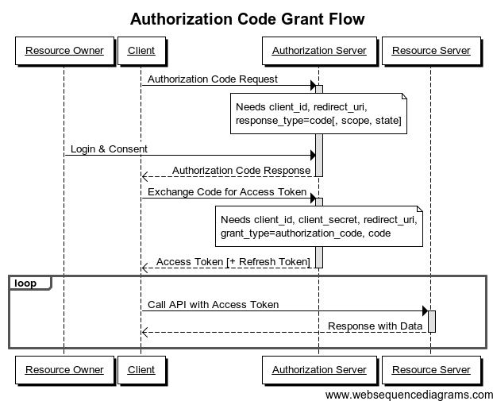

# How to Authorize Clients (app-web-auth v3)

|         |                                  |
| ------- | -------------------------------- |
| Author  | Thiébaud Modoux (tmodoux@pryv.com) |
| Version | 5 (07.11.2018)              |

## 0. Introduction

Let's imagine an hospital which provides a web application to allow patients to consult their health data online, such as blood test results. This hospital chose to use Pryv to manage such private data, so each patient will have to create a Pryv account. In order to push the blood test results to a patient Pryv account, the hospital application, that we identify as client application, must first obtain the patient consent. This process is what we identify as authorizing the client application, at the end of which the patient allow the hospital application to have access to specific parts of the patient Pryv account, and with specific access levels.

In this document, we will explain how we currently implement the client authorization process and present the various softwares taking part in this process, as responsible or as dependant parties. We will then propose a new design for implementing the authorization process in a more easy to understand, easy to adapt and modern way. This new design will mainly plan a version 3 of app-web-auth, its views and flows but also the general requirements of the authorization process, which could also provoke changes to others parts of software such as lib-javascript, service-register or app-web-access.

Finally, we propose a comparison with the Oauth2 authorization flow, first because it can help to understand ours, and second because our authorization flow aspires to be Oauth compliant or at least is greatly inspired by it.

## 1. Involved parties

In this section we want to list all the Pryv pieces of software which take part of the authorization process (responsible parties) and the ones which rely on the implementation of this process. The goal is to be aware of the scope of this project and to maybe predict the side effects brought by potential changes.

### Responsible parties

#### App-web-auth

App-web-auth is a web application which handles the biggest part of the authorization process. Also identified as the authorization page, it mainly consists in a web page which is oppened by a client application and allows a Pryv user to authenticate and grant access to a subset of its account to the requesting application. App-web-auth also implements Pryv user registration and password reset capabilities. It's obviously the software piece we will be the most interested in this document and for our redesign steps.

#### Service-register

Service-register is one of the main Pryv.io component, its primary role is to serve as dns and hold the mapping between usernames and service-core servers storing the data. But it also participates as Authorization server during the authorization process. This role involves handling access requests coming from client applications,  persisting the state of authorization processes (most client applications are non-persistent), providing various settings through service-info (such as api url, access url, helpdesk url, etc…) and some information about users (such as email-username mapping).

#### Service-core

Working in pair with service-register, service-core is another main Pryv.io component which holds users data and regulates accesses. Thus, it is also involved in the authorization process with tasks such as Pryv user authentication (login), creation and management of application accesses.

#### Lib-javascript

The Pryv javascript library is often imported in client web applications because it contains various functions and elements which facilitates the implementation of the authorization process. The most important element is the Pryv login button, which already contains almost all the authorization logic, such as starting the access request from the client application, loging in/out Pryv users and polling.

It is also excessively used in web applications (app-web-auth and app-web-access) for URL parameters parsing or retrieval/setup of configuration settings (language, returnUrl, Pryv domain, appId, requestedPermissions, etc…).

#### Lib-java

As lib-javascript for client web applications, lib-java is useful to ease the implementation of the authorization flow in mobile application. The two main classes it provides, AuthView and AuthController, implement the same logic as the one in the Pryv button from lib-javascript. Since the authorization flow and its implementation stays pretty much similar, may this be with lib-java or lib-javascript, we will only speak about lib-javascript for the rest of this document (also, lib-javascript looks more complex).

### Dependant parties

Parties that we know currently dependant from the implementation of the Pryv authorization flow range from bridges and web applications using the lib-javascript with its Pryv button to mobile apps using lib-java and its Auth View/Controller.

More generally, it touches all client applications maintained by Pryv and going through the authentication and consent request of a Pryv user in order to gain an app access. This means a lot of dependant parties.

Few examples: app-web-access, app-android-iHealth, bridge-ifttt...

## 2. Views description

### Authorization view

The Authorization View shows a form which invites a Pryv user to login sign-in using **username** or **email** and **password**. Once successfuly authenticated, the view changes and prompts a list of **permissions** as well as the **appId** of the requesting application. The listing of permissions allows the Pryv user to check clearly on which **streams/tags?** each permission apply to and with which **access level**. Finally, the Pryv user can **reject** or **accept** the access request by clicking on one of the two buttons.

From this view, the user can go to the **Register view** by clicking on a _Create an account_ button, or to the **Reset password View** by clicking on a _Forgot password_ button.

Also, a link to the Pryv **helpdesk** (pryv.com/helpdesk) is available.

Finally, an **alert block** should print any errors (such as invalid credentials) or informative/loading messages.

### Register view

The Register View shows a form which allows to create a new Pryv user by providing **email**, **username**, **password**, password **confirmation**. It also presents a dropdown list of available **hostings** (aka Pryv cores) so that the new user can choose where the data will be stored. Once the user is created, an informative message is printed and the **Authorization view** is loaded with the credentials (or only username?) of the newly created user.

From this view, the user can go back to the **Authorization view** by clicking on a _Already a Pryv user? Sign in_ button.

Also, a link to the **terms of use** is available (pryv.com/terms-of-use).

Finally, an **alert block** should print any errors (such as user already existing) or informative/loading messages.

### Reset password view

The Reset password View presents a first form which allows the user to request a password reset by providing the **username**. The user will then be informed that an **email** containing a **reset link** has been sent. Clicking on this link opens again the Reset password View but additionally provides a **reset token**, so that a second form is presented to the user, now asking to provide **username,** **new password** and new password **confirmation**.

From this view, the user can go back to the **Authorization view** by clicking on a _Go back to Sign in_ button.

Finally, an **alert block** should print any errors (such as unkown username) or informative/loading messages.

### Signin hub view

The Signin hub View proposes a simple form with a single **username** field, which then redirect to the **signin page** of this Pryv user (if existing); https://username.domain/#/SignIn.

It also allows to go to the **Register View** thanks to a button.

Sould we keep this view or not?

## 3. Flows description

### Authorization flow (app-web-access example)

To gain a better understanding of the current implementation of the Authorization flow, let's take as example a real client application, which is maintained by us; [app-web-access](http://pryv.github.io/app-access/). The goal of this web application is to generate application accesses, so it demonstrate ideally what has to be done to implement the Authorization flow in client applications. See [this document](https://int.pryv.com/PryvIO/InternalDesignJournal/26Oct-AppWebAuthRelaunch) for an older description of this application.

We described in details the authorization flow in _auth_flow_ flowchart, taking app-web-access as an example of a client app. In the below subsections, we propose some additional comments in order to better understand this chart. Also, we propose the following classification of all the authorization steps in the following four parts: 

1. Authorization request from client application: steps 1, 2 and 3

2. Pryv user authentication: steps 4, 5 and 6

3. User consent and app access creation: steps 7 and 8

4. Response to client application: steps 9 and 10

#### Popup VS return URL

When the Pryv user clicks on the Pryv button to login (see step 4.a), the authorization page opens (app-web-auth). Depending on the client (mobile or desktop, popup enabled or not), this page may opens in pop-up or full page mode.

In both cases, the app-web-access page should be able to know when the authorization flow (taking place in app-web-auth) is over and retrieve the app token. There are two methods for achieving this, depending on if using popup or not.

#### Popup

By default, the authorization page (app-web-auth) should opens as a popup. In this case, app-web-access will poll register (step 4b) until it receives an accepted status alongside with the app token. App-web-auth does not need to advertise app-web-access when the authorization flow is over, so it can just close the popup at the end (step 9c).

#### Return URL

If the client does not allow or support pop-up mode, the authorization page will load in current page, replacing the app-web-access. This means that the polling method is not valid here (step 4b does not happen). Also, app-web-access is dependant on app-web-auth, which needs to advertise app-web-access when the authorization flow is over. This is done by having app-web-access providing a return URL at the start of the process, and app-web-auth redirecting to this URL at the end (step 9c). It returns the required values (status, lang, poll key) and the generated app token as query parameters.

By default, the return URL value is determined by lib-javascript, depending on the client capabilities. Optionally, the client can also provide a custom return URL while filing the auth request (step 1a). This can be useful for example if the client app wants to forward the access to a third party.

Finally, the return URL field accepts two special values; #auto wich is the default behaviour explained above, and #self which sets the current page as return URL.

#### Refusing app access

While requesting access for the client app, the user can see the requested permissions and give a consent. But there is another situation where the user refuses, which is not detailed in the flowchart.

In this case, the flow stops before creating the app access (step 8b) and app-web-auth sends a state with status=refused (instead of accepted) to service-register (similar to step 9a). Then, app-web-access will catch this refused status and prints a message instead of printing the app token (similar to step 10a, 10b).

#### Errors during the flow

Various errors (such as invalid app id...) can occur during the authorization flow but are not mentioned in the flowchart. In such cases, the situation is similar the one explained above (when the user refuse the access request); we send a state with status=error (instead of refused) to service-register and app-web-access retrieves and prints the error.

### Register flow

### Reset password flow

## 4. Additional requirements

### Utilities

- View toggling, error handling/console/loader: handle with View.js
- Permissions data structure
- URL formating
- Retrieving of register/service-info, domain and other settings
- Locals, traduction
- oauthstate and recladevel
- Tag permissions?

### Review current schemes

- Raw HTTP calls VS lib-js functions, clean lib-js (remove unused parameters, use poll key)
- Status 4xx from API should not be treated as ok
- Polling logic: polling key + URL instead of returnURL

### Customization

- Allow customization through register/service/info: version, register, access, api, name, home, support, terms, media (logo), apps (apps logo)
- Make sure that custom properties coming from serviceinfo do not open breaches (such as including scripts)

## 5. Oauth analogy

Pryv client authorization flow is inspired from the OAuth2 protocol. This is why we present here a comparison between these similar flows. Let us first presents the main entities participating in the OAuth2 protocol and their Pryv equivalent:

- Resource owner = Pryv account
- Resource server = Pryv core (holding Pryv data)
- Client app = App requesting access to the Pryv account
- Authorization server = Service-register
- Request token = Polling key, received after an access request
- Access token = App token
- Access scope = Access permissions, defining accessible streams and access level
- Refresh token = Expiring token feature ?

Beside these entities, the OAuth2 protocol defines four different grant types, which induces variations in the authorization flow depending on the nature of the client involved in obtaining an access token. From these four grant types, two are revelant for Pryv: Authorization Code Grant and Implicit Grant.

### Authorization Code Grant

The Authorization Code grant flow corresponds to the pop-up mode with polling in the Pryv authorization flow.

### Implicit Grant

Implicit grant flow is similar to the no-pop-up mode with return URL in the Pryv authorization flow.

## 6. App-web-auth3

In this section, we would like to propose a C4 model for a new implementaiton of app-web-auth, based on the Vue.js and Vuetify.js frameworks. We will now define the four level of abstraction of this model, present the resulting diagrams and finally expose our plans for testing the new software.

### Level 1-2: Context and Containers

Level 1 presents the big picture of the software system we will build (app-web-auth3), as well as its context, namely its interactions with people and other software systems.

Level 2 is a zoom in app-web-auth3 software system and present the containers which compose it, such as applications, data stores or micro-microservices. At this point, we also announce our technology decisions.

### Level 3: Components

For level 3, we draft three diagrams, one for each views (user authentication, user registration and password reset), depicting all components contained in a container. By components, we mean grouping of related functionality which map to real abstractions (grouping of code).

### Level 4: Code

For the code part, we explain the actual implementation here: https://github.com/pryv/app-web-auth3#the-code-explained.

### Testing

We plan to have tests for app-web-auth3 spanning on three test types which we will present now.

#### 1) Unit tests (Component Contract)

Each unit test focuses on one Vue component (hence the alternative name 'Component contract'), treating it as black box, injecting inputs (user action, props, form fields) and verifying that outputs are as expected (rendering, function calls). We plan to have about one unit test per Vue component.

To give a more explicit example, such test could consist of programmatically filling a form, ensuring that the form validation is robust (with valid and invalid inputs) and that the submit function is finally invoked.

We will use [Jest](https://facebook.github.io/jest/) and the built-in [Vue Test Utils](https://github.com/vuejs/vue-test-utils).

#### 2) Snapshot tests

Snapshot tests take a snapshot of the components of our app and compare it against the previous snapshot (previous test run). It allows to control the rendering of our app and safeguard unintended changes to components.

We plan to have a little of these tests, basically one per view (authentication view, register-user view and reset-password view).

Here agains we will use [Jest](https://facebook.github.io/jest/) and the built-in [Vue Test Utils](https://github.com/vuejs/vue-test-utils).

#### 3) End to end tests (E2E)

E2E tests are the heaviest tests, since they checks that the whole app runs correctly, by opening a browser and running through actions.

We will use [TestCafe](https://github.com/DevExpress/testcafe) as framework to help us to test the following flows:

##### Navigation and external links

1. Check that 'helpdesk' (auth view) and 'terms of use' (register view) links are valid
2. Check navigation between views (register <=> auth <=> reset)

##### User creation, sign in and permissions

1. Fill the form to register a new user (register view)

2. Authenticate with the newly created user (auth view)

3. Validate the displayed permissions and accept

4. Validate the flow termination (popup close, returnUrl redirect)

##### Password reset

1. Request a password reset (reset view)
2. Validate the confirmation message and the call to email sending function
3. Open the reset link, check that the view changed and propose to set a new password
4. Change the password, validate the authentication (auth view) with the new credentials

##### Error display

1. Try to authenticate (auth view) with existing username but wrong password, validate the error message
2. Try to authenticate (auth view) with invalid username and password, vaidate the error message
3. Try to register a new user (register view) with a reserved email, validate the error message
4. Try to register a new user (register view) with a reserved username, validate the error message
5. Try to reset password (reset view) with an unexisting username, validate the error message
6. Confront the validation of all forms with invalid parameters (auth view, register view, reset view)

##### Routing

1. Validate all routes (/register, /reset, /auth)
2. Check that querystring is handled properly
3. Validate redirections (such as for standalone pages)