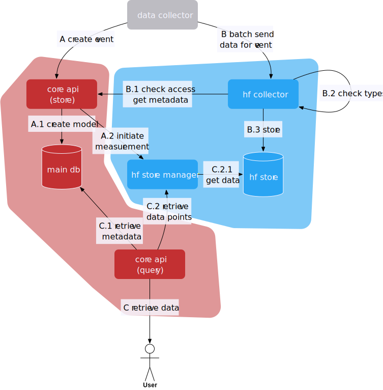
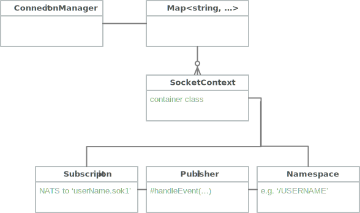
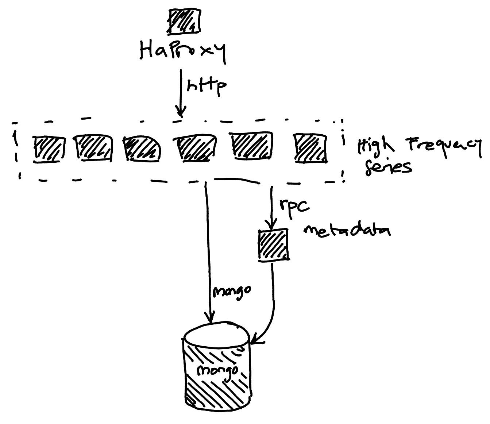

|         |                          |
| ------- | ------------------------ |
| Version | 9 (20180409)             |
| Author  | Kaspar Schiess (Pryv SA) |

High Frequency Pryv
{: .doc_title} 

Phase I - Q2 2018 - Requirements & Design
{: .doc_subtitle} 

Requirements and Design for phase I of High Frequency Pryv. Supersedes v2 of earlier design document.

In Spring 2017, we implemented part of this design already. This implementation is available in service-core/feature/high_frequency_series. The present documents explains the design chosen and expands on it. We aim to release this as a new Pryv feature in Q2 2018. 

| Version | Change                                                       |
| ------- | ------------------------------------------------------------ |
| 2       | Base version for start of implementation.                    |
| 3       | Added chapter on 'Vertical Scaling' and socket.io connections. |
| 4       | Added design notes on 'Vertical Scaling'.                    |
| 5       | Added design decision to continue in a separate express application for now. |
| 6       | Document API Changes and start Use Case Modelling            |
| 7       | Added Series Batch operation.                                |
| 8       | Adds Metadata Update Service.                                |
| 9       | Various small corrections to existing text.                  |

---

# Architecture

## Summary

Pryv gets a new database backend. Our customers want to input homogenous data at high speeds while using little disk space. This document lays out how we intend to implement this. To get high speeds, we'll not write to MongoDB at all for this kind of data, we'll write the data to InfluxDB, a time-series database that is optimised just for the features mentioned above. 

Here's an overview of the features that this document introduces: 

* Allow creating events with a special data type ('series:mass/kg'). These events don't have content themselves, instead, they serve as handle for a high frequency data stream.
* We add several methods of inputting and outputting data to Pryv, geared towards batch processing of data: CSV and a special tabular JSON variant we'll call flatJSON. Data can be input by either the current HTTPS/Websocket transport or via an encrypted MQTT transport. 
* To allow many api-server processes on one machine, we will identify state held by the process and factor it out, yielding a code-base that can be scaled horizontally on a single machine (or even multiple machines).
* To wrap these changes up, we will extend documentation and provide a 'Getting Started' guide for high frequency data. 

The above changes - once complete - will be released as Pryv 1.3 (or Pryv 2.0) in Q2 2018 (approximately).

## Overview



The above diagram shows operation sequence for three operations

* A: Prepare HF Insert
* B: Insert Data 
* C: Query Data

We create a path across the codebase that only includes speed optimised code, called 'high frequency path'. Slow operations such as accessing MongoDB and other backend systems except InfluxDB should be absent from this code path to guarantee fast data ingest (blue area in the diagram).

## Use Cases

### Add High Frequency data

### Query HF data

### Delete HF data

### Delete HF data in a time range

# Design

## Vertical Scaling

Pryv IO version 1.2 doesn't support more than one api-server process, which means that a core machine can only process data using a single OS process. Javascript Async IO makes this less bad than it sounds, allowing us to create ~ 1000 events per second. (But) We observed that our backend store MongoDB doesn't saturate at that rate. If we could increase the number of processes and load balance between them, we'd be able to use bigger machines and store more data in less time. 

In HF Pryv, we would like to be able to scale vertically, increasing the number of processes and thus do more concurrent work. The only obstacle is socket.io communication - or more specifically, notifications that Pryv IO sends out via socket.io. The code that implements these notifications relies on being in the same process space as the socket.io connection. 

To remove that obstacle, we will introduce a [NATS PUB/SUB broker](http://nats.io/documentation/) and connect all the api-server processes to it. Notifications on data changes will travel from the process that receives the change via NATS to all processes that are currently interested in changes for the given selector. This is illustrated in the diagram below: 


NATS allows publication of messages to 'subjects', in the form of a string. These subjects are split into parts by the char '.' - for example, this is a valid subject: '`a.b.c.d`'. Subscriptions match to subjects; subjects either match literally or using either '*' or '>' as a wildcard; the latter matches the whole postfix, the earlier matches a single token. 

Every time a new socket.io connection is made, we will subscribe to the events of a given user. Subscription will be made to a string like this: 

~~~
UserName.sok1
# ^    ^------ 'socket.io version 1' - assuming we'll deal with variants
#  \---------- scopes events to the current user
~~~

Messages published to this subject will be [msgpack](https://msgpack.org/)-encoded binary messages. Message content will be as follows: 

~~~javascript
'event_type' // a simple string for now
~~~

'event_type' is one of the following: 'server-ready', 'account-changed', 'accesses-changed', 'followed-slices-changed', 'streams-changed', 'events-changed'. Here's what should happen when a new socket.io connection is made: 

~~~python
def onConnect(path, callback): 
    # Check Authorisation and User
    userName = extractUserName(path)
    token = handshakeData.query.auth
    pryvContext = storage.getUserContext(userName, token)
    
    if ! pryvContext.isAuthValid(): 
      return callback('Invalid Authorisation')
    
    connectionManager.addConnection(
      userName, pryvContext)
~~~

Here's a class diagram of '`ConnectionManager`': 



Managing lifetimes of objects will be a challenge, since the socket.io library handles a lot of this as well. Our implementation should try to detect socket disconnects and as a consequence remove the '`SocketContext`' instance when the last connection to a namespace disappears. In practice, we might miss some disconnect events, since there are a million ways to break something. This is not a problem; there will be at most one such context per user on the core. Usernames may not contain dots ('.') themselves, they are safe for use as part of the subject. 

The '`Publisher`' is responsible for receiving a decoded NATS message and translating it to a socket.io (v1) message. Interposing this class will allow to create a chain of filters between reception and sending; for example, we will interpose a 'debounce' operation between these, sending out less events than we receive, at most one per 200ms. Just to illustrate this, here's pseudo-code for all stages of message reception: 

~~~python
# Subscription: subscribed to 'userid.sok1'
def onMessage(packet, _, subject): 
    userName = extractUserName(subject)
    msg = msgpack.decode(packet)
    
    downstream.handle(userName, msg)
    
# Publisher
def handle(name, msg):
    typeName = msg 			# there might be more to do here later.
    namespace.send([typeName, name])
    
# Namespace - from socket.io library, sends out message to all connected sockets. 
~~~

By creating a NATS subscription per socket.io namespace, we allow NATS to perform message culling  before messages are delivered to the nodejs process. This in turn lightens the load for processes that have no subscription. 

## Connection between Pryv and InfluxDB

*API surface* (how we create and see High Frequency data) and mapping schema to InfluxDB need to fulfill a number of conditions. From the outside, HF data should be 

* Easy to create and to input
* Easy to query from.
* allowed to become really big, within a single stream and type as well as overall for the Pryv user account. 

On the inside, we must respect the various guides and best practices that InfluxDB publishes for design: 

* [Schema and Data Layout](https://docs.influxdata.com/influxdb/v1.3/concepts/schema_and_data_layout/)
* Keep series cardinality down (see this [FAQ](https://docs.influxdata.com/influxdb/v1.3/troubleshooting/frequently-asked-questions/#why-does-series-cardinality-matter)). We will need to encode some information in tags, however we should not overdo it, since tag cardinality is a direct multiplier towards series count. Consider < 100'000 series per user a goal. Relationship between series cardinality and RAM is exponential. 


* Not encode data in measurement names, as per direct recommendation. 

Here's the outline of the mapping we choose:

* We will use the HF backend store only for HF data, not for other events and especially not for untyped free-form events. 


* One InfluxDB database per user, named after the users internal id, i.e. `pryv-userdb.ID`. This is chosen mainly to ensure vertical separation of user data from other users data on the same machine. 
* High Frequency data is _typed_ and _verified_. Types come from the list of types already in the API.
* Not all existing Pryv types can be used in high frequency data collection. In particular, only types that are composed of only numeric or boolean fields can be stored as HF data. 
* One InfluxDB measurement (table) per event that contains HF data. While this makes it harder to merge these streams together, it gives us a nice unit to manipulate when doing data administration.
* Pryv remembers the duration you used the data collection event for. This will be used as implicit query boundary for the underlying data. 
* Operations that are allowed on HF data: Insert, Delete (within a given time range). We don't support updating HF data, since the underlying store is not optimised for this. 
* The creating token is stored as part of the measurement under the tag '_createdBy'. We reserve tags starting with '\_' (underscore) to be private to Pryv. 


## API Changes

### POST /events, { type: 'series:X' }

Creates a 'series' event, capable of storing high frequency data. 

### POST /events/{:event_id}/attachments

Aliases the 'POST /events/{:event_id}' route we have today. We plan to not document the old route anymore and deprecate it over time. 

### POST /events/{:event_id}/series

Add data to a series event. 

The fields {'duration', 'modified', 'modifiedBy'} are adjusted in the events metadata. This happens after some delay, which should be configurable. These updates will get lost when the server is interrupted. 

Input data format as input looks like this:

~~~
SERIES_DATA = {
    format: "flatJSON", 
    fields: Array<string>, 
    points: Array<DATA_POINT>
}

DATA_POINT = Array<VALUE>

VALUE = string | number | boolean
~~~

Fields in "fields" will name the columns of the data matrix in "points". Allowed fields include "value" for numeric Pryv types and object field names for complex Pryv types. 

Additionally, the field "timestamp" is always required and identifies the column that contains the timestamp value for each individual DATA_POINT.

### POST /series/batch

Add data to multiple series events in a single operation. This covers the use case of storing data from many sensors in a single request and will be the most important addition. 

The data format we choose here will be a collection of individual store operations, which in turn will identify the event to store data into and the data to store. 

~~~
SERIES_BATCH = {
    format: "seriesBatch", 
    data: Array<SERIES_STORE_OP>
}

SERIES_STORE_OP = {
	eventId: string, 
	data: SERIES_DATA
}

SERIES_DATA = {
    format: "flatJSON", 
    fields: Array<string>, 
    points: Array<DATA_POINT>
}

DATA_POINT = Array<VALUE>

VALUE = string | number | boolean
~~~

We compose this message from individual SERIES_DATA objects because there will be less message formats to learn about for our users this way. 

### GET /events

Lists events. Doesn't return 'series' events in normal queries, since usually the code using this endpoint will not be equipped to handle this data type. Allow queries for 'series:mass/kg' or even 'series:mass/\*', 'series:\*'. The query flag 'includeSeries' can be given, in which case all events are returned. 

### GET /events/{:event_id}/series

Return data from the high frequency series stored in the event with id 'event_id'. 

Data will be output in the same format that it is input: 

```
SERIES_DATA = {
    format: "flatJSON", 
    fields: Array<string>, 
    points: Array<DATA_POINT>
}

DATA_POINT = Array<VALUE>

VALUE = string | number | boolean
```

Fields in this case include simply all the fields that we store in InfluxDB for this series. We will allow to choose from the available fields as part of the query. 

### DELETE /events/{:event_id}

Deletes the event and the high frequency series stored in it. 

### DELETE /events/{:event_id}/series

Allows deleting a part or all of the high frequency series, while still retaining the collection event. 

## Changes To Various Locations

### Updates on Events 

To ensure that data is coherent, we need to disallow updates to the 'duration', 'content' and 'type' field of a high frequency series. 

## Series Event Lifecycle

| Action                 | Implies                                                      |
| ---------------------- | ------------------------------------------------------------ |
| new series event       | creates structure in mongo                                   |
| first time data append | creates influx database, creates influx measurement, appends data to influx measurement, eventual update of event (deadline, delay) |
| further data append    | appends data to influx measurement, eventual update of event (deadline, delay) |
| delete event           | deletes mongo event, eventually deletes influx measurement   |

### Eventual MongoDB Update

To untie the fast data ingestion path (via *HFS Server* and *InfluxDB*) from the slow path tied up by MongoDB, we delay updates to these event fields and perform them asynchronously: 

* duration
* modified, modifiedBy

For details on how this works, please refer to the 'Metadata Update Service' section below. 

### Playing nice with Versions

If we assume a direct link between a mongodb 'event' and an influxdb measurement via something like the mongodb event id, we get into trouble on certain operations. For example, when deleting an event and trying to recreate the same event (same event id) just afterwards. There are two ways to implement this case: 

* InfluxDB measurement is identified by the event id. To be able to reuse this id immediately after the delete operation, we need to synchronously delete the MongoDB event and the InfluxDB measurement. 
* InfluxDB measurement is identified by an unrelated child id. When performing a delete, only the MongoDB event is deleted; deletion of the InfluxDB measurement is delayed and performed at a later time. Since we're using unique child ids unrelated to the external key eventId, we can just recreate a new InfluxDB measurement for the new event. 

In our effort to decouple the two databases as much as possible, we're choosing the second option. A given users InfluxDB database will contain internally enumerated measurements; MongoDB will in turn contain the necessary data to map these measurements to events. 

This variant implies that we need to generate unique ids for measurements within the scope of a user account. This can be done within the confines of MongoDB during event creation. 

## Metadata Update

We reflect changes to the series behind an event out of band. Updating a series with new data will _eventually_ also update the event stored in MongoDB. We're concerned with a) decoupling the databases logically and b) keeping accesses to MongoDB out of the fast data ingestion path. To do so, we will schedule a MongoDB metadata update on every high frequency data append operation. 

Once scheduled, this update is made after a small delay of a few seconds. If during this delay there is another update, the actual MongoDB access will be further delayed. We will call this delay 'cooldown', since it allows the data series to 'cool down' before MongoDB is written to. 

We also want to ensure that the MongoDB metadata doesn't get stale. For this purpose, we introduce another delay called 'staleLimit'. It designates the time after which we will write a metadata update to MongoDB, regardless of cooldown. This timer starts when the first update is made to a series and elapses regardless of how many updates are made in the mean time. 

Taken together, these timers implement the following requirements: 

* Metadata must be reasonably up to date for consumers. Some time after each update we should give the consumers the guarantee that the changes are visible on the event as well. 

* We must not write to MongoDB on every series update (or even read from it).

Frequent updates often happen with the same actor (token) as author. If we don't immediately update 'modifiedBy' in such a sequence of updates, it is probably not going to be wrong. 


# Implementation

## Vertical Scaling

{: style="width: 15cm"}


The above diagram shows the retained solution; this is a mixture of a class diagram with a a sequence diagram. It emphasises data flow. 

Socket disconnects are handled via the disconnect event that is sent to the manager instance. Our socket.io library already keeps a list of connected clients per namespace; we use this list to clean up the natsSubscriber after a disconnect. 

## Series Batch

### Map Agnostic 

Series batch was implemented in a fully map-agnostic fashion. Since the MetadataLoader/SeriesMetadata implementation determines to what a given events data series are mapped in InfluxDB (database, measurement), we cannot assume that a single series batch will only ever store into a single database. 

To isolate from changes on that level, a map of 'namespace' to batch data is built, where namespace is the internal name for the influx database. We then iterate across namespaces and perform one 'writePoints' call to InfluxDB per namespace; you cannot write across several databases in one operation in InfluxDB. 

In todays reality, there will only ever be one such call in consequence of a series batch. The implementation supports a future where this doesn't hold anymore. 

## Metadata Update

### Memory Representation

In-memory, data will be represented as a map of event ids to pending updates. The pending update is described by the author of the update, the timestamp and the range the associated data covers. Here's a flowtype representation of this: 

~~~javascript
// Event ids are simply strings
type EventId = string; 
type AccessToken = string; 

// Metadata update for a single event
type MetadataUpdate = {
  eventId: EventId, 				 // event this is relative to
  author: AccessToken,       // update author
  timestamp: number,         // seconds since epoch
  dataMinTimestamp: number,  // earliest data point in update
  dataMaxTimestamp: number,  // latest data point in update
  deadline: Date,            // deadline, latest time this needs to be flushed.
  flushIdle: Date,           // if no additional updates before this, flush.
}

type MetadataUpdateMap = Map<EventId, MetadataUpdate>;
type MetadataUpdateHeap = Heap<Date, MetadataUpdate>; 
~~~

The field 'deadline' is linked to the 'staleLimit' configuration value; the field 'flushIdle' is linked to the 'cooldown' configuration value. 

Metadata updates are stored in a map (`MetadataUpdateMap`) for retrieval during the `store` operation (see below). They are also stored in a binary heap (`MetadataUpdateHeap `) ordered by the earliest deadline for the updates. During normal operation, events enter the system and are found and updated via the map. They are entered into the heap using `min(deadline, flushIdle)` as key; the earliest such deadline from the heap is then used for setting up a timer. 

### Algorithm

This is the algorithm for managing this data structure: 

~~~python
# Stores the given update (or merges with existing updates).
def store(update): 
  eventId = update.eventId
  if eventId in updateMap: 
    oldUpdate = updateMap[eventId]
    merge(oldUpdate, update)
    heap.update(oldUpdate)
  else:
    updateMap[eventId] = update
    heap.insert(update)
    
# Overwrites target with the merged values from (target, source). 
def merge(target, source):
  target.author = source.author
  target.timestamp = max(target.timestamp, source.timestamp)
  target.dataMinTimestamp = min(target.dataMinTimestamp, source.dataMinTimestamp)
  target.dataMaxTimestamp = max(target.dataMaxTimestamp, source.dataMaxTimestamp)
  
  # Earlier deadline wins
  target.deadline = min(target.deadline, source.deadline)
  
  # Later flushIdle wins (we'll wait until updates cool down)
  target.flushIdle = max(target.flushIdle, source.flushIdle)
  
# Called by the heap once the deadline for the first item rolls around.
def heapTimerElapsed(now): 
  while heap.size()>0 and deadlineForUpdate(heap.peek()) < now:
    item = heap.pop()
  	map.delete(item.eventId)
    
    flush(item)
    
def deadlineForUpdate(item):
  return min(item.flushIdle, item.deadline)
~~~

### Physical Deployment

In a practical setup, there are many instances (OS processes) of the HFS server component. This allows splitting all the work associated with parsing and express request handling among all of the instances. 

The metadata updates on the other hand should not be attached to several processes; there will be less updates to MongoDB if we pool all the updates on a single machine and only perform them once the collective deadline elapses. To allow this, we create a new service called 'metadata'. This service holds a connection to MongoDB and provides the following API via our internal RPC mechanism. 

~~~protobuf
message UpdateMetadataRequest {
  string eventId = 1; 
  string author = 2; 
  uint64 timestamp = 3; 
  uint64 dataMinTimestamp = 4; 
  uint64 dataMaxTimestamp = 5; 
}

message UpdateMetadataResponse {
}

service MetadataUpdateService {
  rpc ScheduleUpdate(UpdateMetadataRequest) returns UpdateMetadataResponse;
}
~~~

The 'deadline' and the 'flushIdle' field will be set by the update service once the message is handled. Once the service receives an 'UpdateMetadataRequest', it schedules the update and then returns. Updates are done by the timer that is linked to the heap. 

{: style="width: 12cm"}




---


# Appendix

## A Design Discussions

### API Variants

Two approaches to HF Pryv seem possible a priori: the variant chosen above that creates HF data as a sub-resource to events ('POST /events/{id}/series') and another variant where the API would be the current Pryv API without additions; in this variant, HF data would have to be added as normal events ('POST /events'). 

We've chosen the former in spring 2017 and will be keeping it for now, after some discussion. Here in short form why we decide so: 

* Not modifying the API for HF Pryv would be nice, since that would make all the old code HF compatible. 
* This would mean that we cannot have metadata associated with the HF events, since we've got no place to store them. 
* It would also mean that when querying data back, we'd be combining all data streams into a single stream. 
* This seems like a problem; perhaps the EKG you're recording right now is not measured by the same device you used yesterday. There would be no place to store this information, and worse yet: no way of telling whether you're looking at yesterdays data gathering, todays - or a mixture of both. 
* Even if the 'HF transparent' API might seem desirable on the surface, these disadvantages are quite unlike Pryv. 

We decide (for these reasons):

* To keep the prototype created in spring 2017 as is and bring it to maturity, using the special API we designed then. 
* Once we've got both data in and data out for this method, we can start considering combined query methods that would return both traditional and HF events. We need to figure out who would use this and what for. 


### Unified API or Separate Processes?

(This was added in response to a strategic discussion on 20180131 between Perki and Kaspar).

The existing code in 'core' service makes it hard to add High Frequency code on top; it was optimised for different requirements than what we need now. To go faster, **we have decided** to revert our decision to merge the new code with the old code right away and **to keep current core 'api' component separate from the 'hfs' component**.

This also means that we will design and **add another API** endpoint to be able to store data into multiple High Frequency collections with one call. This will be redundant with the 'batch' API endpoint we have for existing Pryv calls; they will each be specialised for their own purpose. With this new way of seeing things, batches will not do high frequency, whereas high frequency 'demultiplexed' calls will not do batch. **It introduces a limitation into the API that will need mentioning and explaining**. 

The long term gamble is this: 

* People will probably not need mixed batches for now. So the limitation is not a practical one. 
* If we need to spend time on this topic later on making it right, it will be cheaper than right now. In fact, given our current situation, the time we spend today is 10x the price of the time we spend tomorrow. 
* There are practical solutions to merging the two paradigms; they just take longer. 

Following this explanation, we will now: 

* Continue with the code for the HF Tech Demo, making it into a full-blown implementation. 
* Document the shortcut and its downsides in the design paper. 


