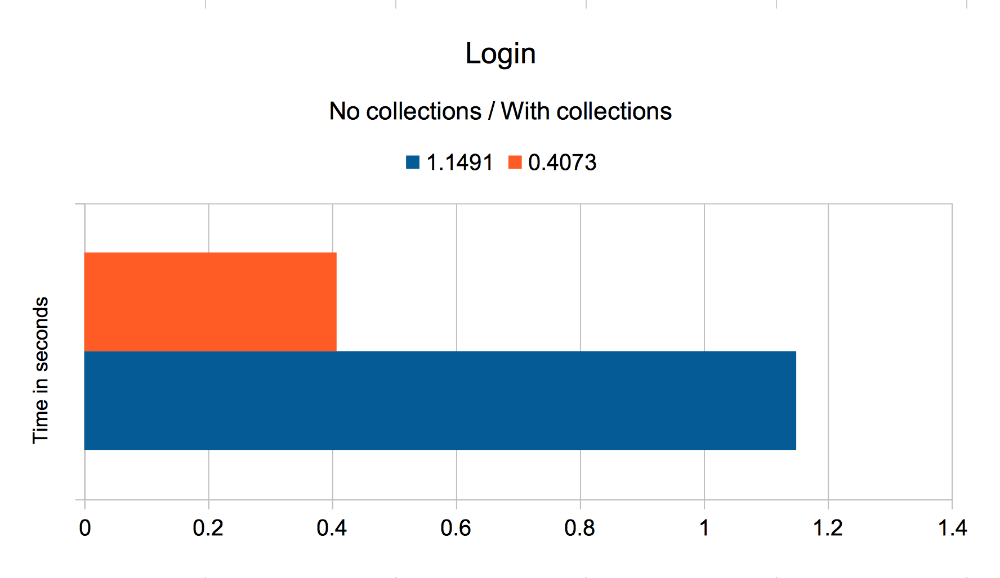
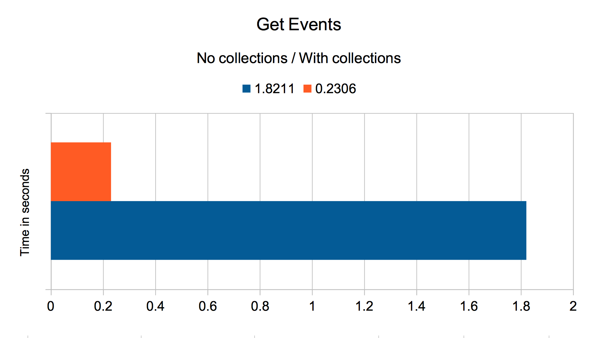
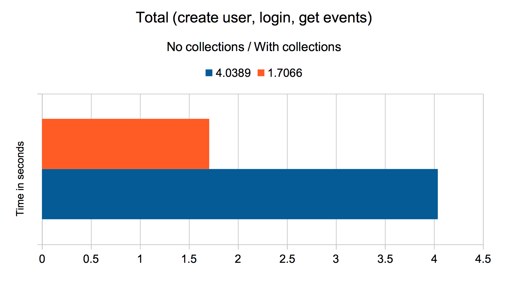

|         |                       |
| ------- | --------------------- |
| Author  | Thiébaud Modoux 	  |
| Date    | 17.12.2018            |
| Version | 1                     |

# Issue

Imad ran into a situation where MongoDb was overloaded by the creation of about 6'000 users on Pryv and the upload of a pdf file for each of them. This overload, due to too much concurrent queries, had as consequence the mongo driver crashing. All subsequent API calls to Pryv then returned with 500 errors 'mongo topology was destroyed'.

The overload situation also triggered an already known bug (see [bug]()), where the user creation calls reach core, then the user is created on core, but because of the mongo overload the creation takes too much time and the response back to register time out. Thus, register will trigger an error and will not create the user on its side. We end up with a faulty user, succesfully created on core but not on register.

The root cause of this overload may be the combination of multiple factors:
- there is only one core machine with low specs (dual core, 4g RAM, maybe no SSD).
- the load and concurrency of the calls on Pryv is not cleverly distributed (client side).
- the initialization of mongo collections and indexes take some time, it happens just after user creation when data (events/streams/accesses) is uploaded to Pryv for the first time.
- mongo reserves RAM while creating users, which is only released after a reboot.

## Mongo collections and indexes initialization

With MongoDb, creating collections and indexes for the first time take some time.
Here is a list of our mongo collections :
- users
- sessions
- passwordResets
- versions
- user.accesses
- user.events
- user.followedSlices
- user.streams

Currently, we dont have a coordinated instant where the initialization of all these collections and according indexes happens. Here is some examples of API methods and their impact on the collections initialization :

| API method | Collections created |
| ------- | --------------------- |
| Create user  | entry in users |
| Login  | user.accesses |
| Get events    | user.events, user.streams |
| Create events | user.events, user.streams, user.followedSlices |

Note that there is no collection for Attachments, the actual files are saved on the file system (attachmentsDirPath) and their ids are linked to the events collection.

We would like to enforce the creation and initialization of all of these collections/indexes at user creation. Thus, we would have a longer delay at user creation but at least it would happen at a known and fixed time.

### Code pointers

#### Database

Methods that actually create the collections if not existing are:
- [getCollection](https://github.com/pryv/service-core/blob/release-1.3/components/storage/src/Database.js#L115)
- [getCollectionSafe](https://github.com/pryv/service-core/blob/release-1.3/components/storage/src/Database.js#L173)

#### Login

Methods that trigger the creation of the **accesses** collections if not existing are:
- [sessionsStorage.getMatching](https://github.com/pryv/service-core/blob/release-1.3/components/api-server/src/methods/auth.js#L54)
- [userAccessesStorage.findOne](https://github.com/pryv/service-core/blob/release-1.3/components/api-server/src/methods/auth.js#L72)

Note that the mongo queries options (such as the indexes to initialize) are defined within API method.

#### Events

Methods that trigger the creation of the **events** collections if not existing are:
- [userEventsStorage.findStreamed](https://github.com/pryv/service-core/blob/release-1.3/components/api-server/src/methods/events.js#L152)
- [Database.findStreamed](https://github.com/pryv/service-core/blob/release-1.3/components/storage/src/Database.js#L253)

Note that the mongo queries options (such as the indexes to initialize) are defined within API method.

## Users pool

In addition to the improvment of mongo collections initialization, we could also add to core the possibility to create a pool of user in advance, anticipating a heavy load of new users on a Pryv platform.

The idea is to add a create-user-pool admin route to the API, so that clients can, at any time, provision their Pryv plateform with a pool of N empty users (they expect their platform to later welcome N users) pool users.

The creation of the pool of users will take time, but later on, when performance will matter (at platform public launch for example), the standard create-user route will only need to extract one empty user from the pool and update it with information about the actual user, avoiding the cost of collections and indexes initialization.

If the pool is empty (administrator of the plateform did not provision enough users or they did not use this feature at all), then standard user-creation will be used.

Another admin route can be added to the API, which role would be to return the current size of the pool. Administrator of the platform would use this route to monitor the current count of available pool users and maintain this number at a reasonnable value by calling the create-user-pool route, according to their needs.

### Code pointers

- [Users storage](https://github.com/pryv/service-core/blob/test/userpool/components/storage/src/Users.js#L142)
- [New routes](https://github.com/pryv/service-core/blob/test/userpool/components/api-server/src/routes/system.js#L36)
- [Create user](https://github.com/pryv/service-core/blob/test/userpool/components/api-server/src/methods/system.js#L38)
- [Create pool user](https://github.com/pryv/service-core/blob/test/userpool/components/api-server/src/methods/system.js#L113)
- [Pool tests](https://github.com/pryv/service-core/blob/test/userpool/components/api-server/test/acceptance/userspool.test.js)

## Assumptions

Before engaging work force to these tasks, we would like to confirm the assumptions below.

### 1. Creating collections and indexes take time

API calls take significantly more time with an empty user, due to the need of creating the mongo collections and indexes (as discussed [above](#Mongo-collections-and-indexes-initialization)).

We set up a benchmark scenario where we first create a user (no collection), then call login (collection user.accesses is created), then call get-events (collection user.events and user.streams are created). We repeat the login and get-events call to evaluate the extra charge of time between an empty user (no collection) and the same user with initialized collections.

We repeat these steps for 10 different users, then report the execution times (in seconds) for each call below as well as mean values among all users. We also compute the total time for all the steps (create user, login, get-events) for both situation; empty user and same user with initialized collections.

Finally, we compute the difference between both total times, which clearly shows the overhead that initializing mongo collections and indexes bring. We also notice that the maximum time for creating an user and its main collections is almost 5 seconds. This upper limit can be interesting if we bring the initialization of all connections back at user creation.

All the results can be consulted in [this csv file](results.csv).

### 2. N events creation for 1 user === N/k events creation for k users.

As expected, we experienced no significant difference in execution times between the creation of 1000 Events for 1 same user and the creation of 1 Event for 1000 different users.

|    Concurrency     |       1000E/1U (s)         |       1E/1000U (s)        |
| ------- | --------------------- | --------------------- |
| 1  | 192.705 	  | 194.934 	  |
| 10  | 20.982 	  | 21.488 	  |
| 100  | 7.083 	  | 11.955 	  |
| 1000  | 9.723 	  | 10.491 	  |

### 3. The nightly script create all the missing collections.

### 4. User creation consumes RAM that is not released/flushed in MongoDB, unless the Mongo container is restarted.

## Q/A

Q: Init collections for all user creation calls (also standard) or only for pool user creation?

A: We init the collections as soon as we create a user, regardless if it's a pool user or not.

Q: Init collections before or after inserting new user? early api response or not?

A: We init collections as soon as the user is created, the API response is sent at the end of the collections initialization.

Q: How to recover a failure/timeout while creating indexes/collections and inserting user? how to avoid inconsistent state (collections initialized but user not inserted)?

A: We had a notion of temp users. Users (pool or not) are first created as temp user, then we try to init the mongo collections and indexes. We finally rename the temp user with the real username only when this init is successfull.

Q: Do we return a failure if collections/indexes creation fails? or do we answer ok anyway?

A: In this case we return an API error and we will have a temp user in the db. This means that the client can still retry the creation of this user (not reserved in the db) and we can later clean the faulty users by filtering the ones containing 'temp@' in username.

Q: Two routes for standard user creation and pool user creation? or same route and check @pool?

A: We keep the existing route for user creation and just add one route for creation pool users.

Q: We now do a findOne pool user at each user creation, it takes time also? 

A: In order to prevent mongo racing conditions, we now use findOneAndUpdate and fallback to standard creation in case of error or empty pool.

Q: Allow to provide nbr of users to add to the pool at once? how do we handle concurrent creation?

A: The pool creation route does not need any argument and will only create one pool user at a time. We want this route to be used by a script, that will take care of the creation of X pool users but while controlling the timing and concurrency of each request and monitoring the current size of the pool thanks to the other new route.

Q: Get pool size route: return current number of pool users + the pending one (being created) ?

A: Interesting idea but for now we will only return the current number of pool users.

Q: How does user pool work with platform having multiple api processes?

A: Pool user creation has been tested also against platform having multiple api processes, it does not make the pool user creation incredibly faster but it works.

Q: How do we handle mongo connections? do we also need a connection pool?

A: For now, we do not want to dig too much into mongo connection pool, we just use the default parameters.

Q: I see some warnings while connecting to the mongo server of some core machines, could it be related to potential performance issues?

2018-11-23T13:54:14.538+0000 I CONTROL  [initandlisten] ** WARNING: /sys/kernel/mm/transparent_hugepage/enabled is 'always'.
2018-11-23T13:54:14.538+0000 I CONTROL  [initandlisten] **        We suggest setting it to 'never'
2018-11-23T13:54:14.538+0000 I CONTROL  [initandlisten] ** WARNING: /sys/kernel/mm/transparent_hugepage/defrag is 'always'.
2018-11-23T13:54:14.538+0000 I CONTROL  [initandlisten] **        We suggest setting it to 'never'
2018-11-23T11:58:20.934+0000 I STORAGE  [initandlisten] ** WARNING: Using the XFS filesystem is strongly recommended with the WiredTiger storage engine
2018-11-23T11:58:20.934+0000 I STORAGE  [initandlisten] **          See http://dochub.mongodb.org/core/prodnotes-filesystem

See https://docs.mongodb.com/manual/tutorial/transparent-huge-pages
and https://docs.mongodb.com/manual/administration/production-notes/#kernel-and-file-systems

A: ???

Q: When mongo restart because of an overload situation, I see that a cleaning task runs, could it help releasing RAM?

2019-01-10T04:37:25.318+0000 I COMMAND  [PeriodicTaskRunner] task: UnusedLockCleaner took: 109ms

A: ???

Q: Enforcing creation of mongo collections and indexes will slow down standard user creation and worsen timeout issue while creating users from reg while not using pool. Is it acceptable?

A: ???

## Implementation

We implemented the changes described above within the following PR: https://github.com/pryv/service-core/pull/157.

To sum up, we tackled the user creation burst issues by adding two new system route to our API, which allow to prepare and monitor a pool of users.

The first route, POST system/pool/create-user, takes no argument and insert a user in the db with a username in the form 'temp@'+cuid and dummy information (passwordHash, email). Then, we force the creation of mongo collections and indexes for this user (user.accesses, user.events, user.followedSlices, user.profile, user.streams), this initialization happens in serie so that we stop creation collections/indexes as soon as an error occurs. Only when and if all these steps are successfull, we update the username of the temp user to 'pool@'+cuid and send the API response, otherwise we trigger an API error.

The second route, GET system/pool/size, returns the count of users in the db with username containing 'pool@'. This number corresponds to the number of users ready to be used from the pool.

We also adapted the existing user creation route, POST /system/create-user, which still takes the same arguments but now try to consume pool users first. To do so, it first uses a db query 'findOneAndUpdate' to look for a user with username containing 'pool@' and atomically update it with real user information. If this query succeeds, we just return the updated user (the user now contains actual information and its collections/indexes are initialized in the db). If the query fails (because of an error or the pool being empty), we fallback to a default user creation. Similarly as for the creation of pool users, we first insert a temp user in the db, then creates collections/indexes and only then rename the temp user with real username. This way, if an error occurs during these steps, we trigger an API error and keep a temp user in the db, which allow to later easily identify faulty users and does not prevent client to try again the creation of the same user.

Finally, we had to modify the storage layer a bit, first by adding the necessary 'count' and 'findAndModify' methods. We also ensured that 'insertOne' as well as 'updateOne' queries trigger the encryption of the password if the according field is existing (important when we update a pool user to a real user). Lastly, we add a generic 'initCollection' method that allows to enforce the creation of a collection and related indexes.
