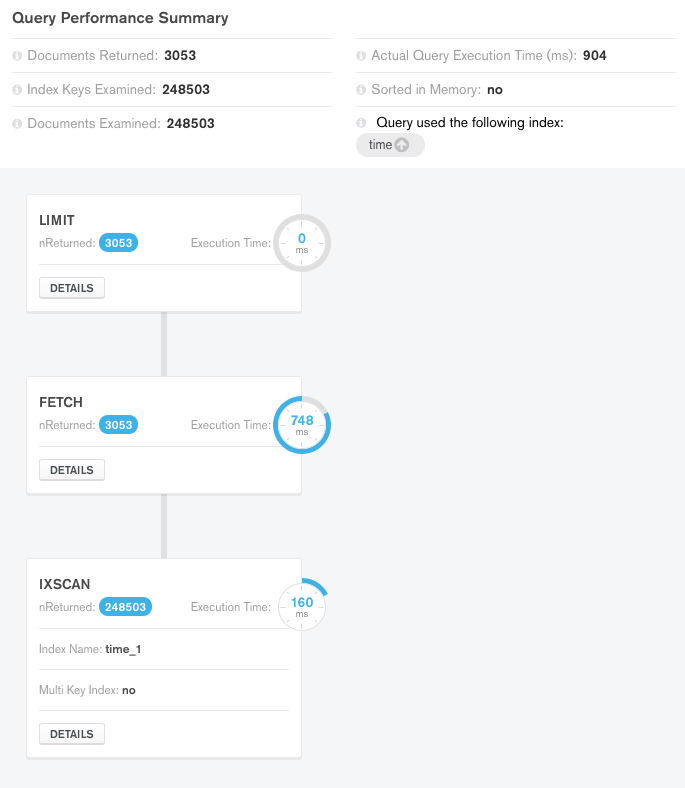

|              |                       |
| ------------ | --------------------- |
| Author       | Thiébaud Modoux (Pryv)    |
| Version      | 1 (18.01.2018)         |
| Distribution | Internally            |

## Issue

Domo Safety reports failing and slow requests and our analysis of these yielded a weird special case: Requests like this one

```
time curl 'https://172293-i.domocare.io/events?&streams\[\]=domosafety&tags\[\]=value&fromTime=1499378400&toTime=1499580000&auth=REDACTED&limit=3057'  | jq
```

exhibits very slow performance (~ 16s). The result of this query contains only 3056 events; if we query using 

```
time curl 'https://172293-i.domocare.io/events?&streams\[\]=domosafety&tags\[\]=value&fromTime=1499378400&toTime=1499580000&auth=REDACTED&limit=3056'  | jq
```

our answer comes back <1s. 

We would *expect* these queries to take the same amount of time. Explain the difference and maybe fix the underlying bug.

Additional links:
[Github issue](https://github.com/pryv/service-core/issues/81),
[Podio card](https://podio.com/pryvcom/domo-pryv/apps/dev-task/items/46),
[Trello card](https://trello.com/c/2DLmINhb) for the issue,
[Trello card](https://trello.com/c/yGWVfftR) for future work.

## API investigations

We start by trying to reproduce these slows requests by confronting a Pryv.me dockerized core, a local core and also the domocare installation with calls similar to the breaking ones above.

Despite our attempts to replicate the faulty situation, we did not manage to come accross the same mediocre performances.

Here are some results of our first investigations:

### 1. Pryv.li/docker service-core (+5k events)

```
time curl 'https://tmodoux.pryv.li/events?tags\[\]=test&streams\[\]=diary&fromTime=1515542400&toTime=1516111561&limit=3000&auth=(hidden)' &> /dev/null

real	0m1.206s
user	0m0.023s
sys	0m0.025s

time curl 'https://tmodoux.pryv.li/events?tags\[\]=test&streams\[\]=diary&fromTime=1515542400&toTime=1516111561&limit=3001&auth=(hidden)' &> /dev/null

real	0m1.117s
user	0m0.022s
sys	0m0.026s
```

### 2. Local service-core with baseline database (1M events)

```
time curl 'http://127.0.0.1:5000/foobar/events?streams\[\]=stream1&fromTime=-1516030718&toTime=1516030718&auth=(hidden)&limit=1000000' &> /dev/null

real	0m17.873s
user	0m0.056s
sys	0m0.147s

time curl 'http://127.0.0.1:5000/foobar/events?streams\[\]=stream1&fromTime=-1516030718&toTime=1516030718&auth=(hidden)&limit=1000001' &> /dev/null

real	0m16.666s
user	0m0.055s
sys	0m0.143s
```

### 3. 172293-i.domocare.io

```
time curl 'https://172293-i.domocare.io/events?&streams\[\]=domosafety&tags\[\]=value&fromTime=1499378400&toTime=1499580000&auth=(hidden)&limit=3057'

real	0m2.096s
user	0m0.020s
sys	0m0.026s

time curl 'https://172293-i.domocare.io/events?&streams\[\]=domosafety&tags\[\]=value&fromTime=1499378400&toTime=1499580000&auth=(hidden)&limit=3056' 
real	0m0.901s
user	0m0.020s
sys	0m0.025s
```

## Mongo investigations

In a second step, we decided to go a bit deeper by looking at MongoDB queries. In particular, we checked how the above slow requests are translated to mongo queries and then excecuted.

Here is an example of such flow:

```
REQUEST:
GET /foobar/events?&streams[]=diary&tags[]=value&fromTime=1
499378400&toTime=1499580000&auth=(hidden)&limit=3057

QUERY:
{"trashed":null,
"deleted":null,
"streamId":{"$in":["stream1"]},
"tags":{"$in":["value"]},
"$or":[{"time":{"$lt":1499378400},"endTime":{"$gte":1499378400}},{"time":{"$gte":1499378400,"$lte":1499580000}}],
"time":{"$lte":1499580000},
"headId":null}

OPTIONS:
{"fields":{},
"sort":{"time":-1},
"skip":null,
"limit":3057}

EXCECUTION:
var cursor = collection.find(query, options.fields)
    .sort(options.sort)
    .skip(options.skip)
    .limit(options.limit)
    .stream();
```

We wanted to setup a local mongoDB database in a state as close as possible to the one of domosafety that who has demonstrated slow results. On this local database, we was then able to analyse how mongoDB exactly handles such queries. The following part provides a step-by-step report of our analysis on mongoDB that can be used to reproduce.

### 1. Setup a local mongoDB database

First, we filled the local database with relevant data (a particular set of events). It can be done using the following simple Ruby script (transform.rb) :

```
#!/usr/bin/env ruby

# Transform a dump for import via mongo

filename = ARGV.first
raise 'No filename given' unless filename

require 'json'
File.open(filename, 'r') do |f|
  json = JSON.load(f)

  puts "use pryv-node;"

  puts %Q(var bulk = db.u_0.events.initializeUnorderedBulkOp();)
  json['events'].each do |event|
    puts %Q(bulk.insert( #{JSON.dump(event)} );)
  end
  puts %Q(bulk.execute();)  
end
```

This script can be excecuted and piped to mongo as follows:

> ruby transform.rb events.txt | mongo

, where _events.txt_ is a file containing a set of Pryv events with the following structure:

```
{"events":[
  {
   "type":"motion/off",
   "duration":300,
   "time":1499579881,
   "streamId":"dbuid-175721-D",
   "tags":["value"],
   "clientData":{"receiveTimestamp":1499580229},
   "created":1499580229.653,
   "createdBy":"ciyods5fctyxly42ri8nchxhp",
   "modified":1499580229.653,
   "modifiedBy":"ciyods5fctyxly42ri8nchxhp",
   "id":"cj4wbcmj9ogonsq2rw24ip99g"
   }
]}
```

### 2. Perform and analyse the mongo query

In order to understand and visualize how exactly mongoDB handles our specific queries (under the hood), we used two GUI tools: [MongoDB Compass](http://www.softpedia.com/get/Internet/Servers/Database-Utils/MongoDB-Compass.shtml) and [Robo 3T](https://robomongo.org/).

Thanks to these tools, we were able to explain (see [explain() function](https://docs.mongodb.com/manual/reference/method/cursor.explain/)) what are doing mongo in our edge cases and where it is spending time, by focusing on axes of analysis such as [query plans selection](https://docs.mongodb.com/manual/core/query-plans/) (losing/winning plans), indexes used, number of documents examinated or query excecution time.

Our analysis was mainly based on the query above and by twicking a bit options like limit (limit=n, limit>n where n=size of result) and sort (time:1, time:-1).

Sadly, we observed some indeterminacy when mongo selects query plans and indexes, i.e. for the same query it sometimes selects different plans leading to different results (and performances), but we have difficulties to identify exactly which parameters are impacting these choices. Still, we found that mongoDB version has an impact on the choice of query plans/indexes, in particular version 3.6.1 appears to behave in a smarter way (or at leat differently) when choosing between multiple indexes than version 3.4.4 (version on which the slow requests occured).

### 3. Illustration of the results
Here are some results of our analysis among different options and mongo versions:

#### Mongo v3.4.4

##### Database state


##### Query without limit, sort


##### Query with limit=n=3053, sort(time:-1)


##### Query with limit=n=3053, sort(time:1)


##### Query with limit>n=3100, sort(time:-1)



##### Query with limit>n=3100, sort(time:1)


#### Mongo v3.6.1

##### Database state


##### Query without limit, sort


##### Query with limit=n=3053, sort(time:-1)


##### Query with limit=n=3053, sort(time:1)


##### Query with limit>n=3100, sort(time:-1)


##### Query with limit>n=3100, sort(time:1)


## Conclusion

We are convinced that there is still optimization to do around indexes and query building. In particular, we could think of better ways of building our queries and indexes so that we facilitate as much as possible the work of mongoDB (using [hints](https://docs.mongodb.com/manual/reference/method/cursor.hint/) for examples), leading to better and more consistent choices of query plans.

See this [Trello card](https://trello.com/c/yGWVfftR) for future task.
