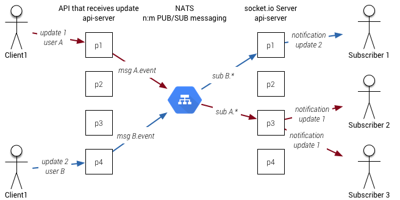
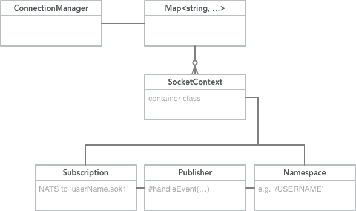
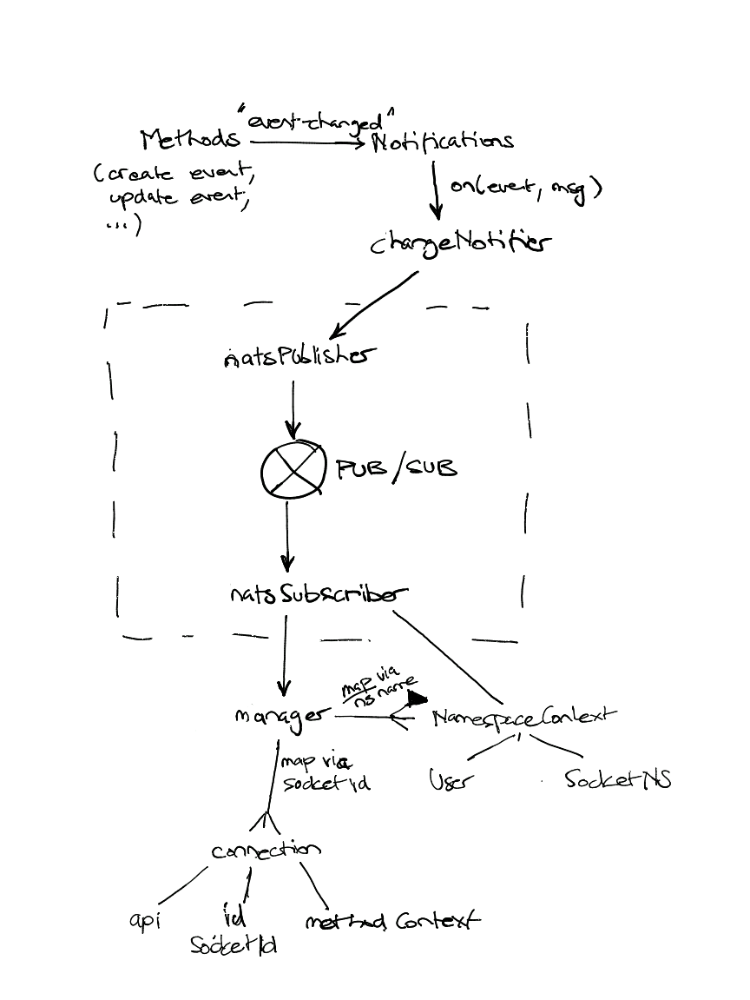

## Vertical Scaling

Pryv IO version 1.2 doesn't support more than one api-server process, which means that a core machine can only process data using a single OS process. Javascript Async IO makes this less bad than it sounds, allowing us to create ~ 1000 events per second. (But) We observed that our backend store MongoDB doesn't saturate at that rate. If we could increase the number of processes and load balance between them, we'd be able to use bigger machines and store more data in less time. 

In HF Pryv, we would like to be able to scale vertically, increasing the number of processes and thus do more concurrent work. The only obstacle is socket.io communication - or more specifically, notifications that Pryv IO sends out via socket.io. The code that implements these notifications relies on being in the same process space as the socket.io connection. 

To remove that obstacle, we will introduce a [NATS PUB/SUB broker](http://nats.io/documentation/) and connect all the api-server processes to it. Notifications on data changes will travel from the process that receives the change via NATS to all processes that are currently interested in changes for the given selector. This is illustrated in the diagram below: 



NATS allows publication of messages to 'subjects', in the form of a string. These subjects are split into parts by the char '.' - for example, this is a valid subject: '`a.b.c.d`'. Subscriptions match to subjects; subjects either match literally or using either '*' or '>' as a wildcard; the latter matches the whole postfix, the earlier matches a single token. 

Every time a new socket.io connection is made, we will subscribe to the events of a given user. Subscription will be made to a string like this: 

```
UserName.sok1
# ^    ^------ 'socket.io version 1' - assuming we'll deal with variants
#  \---------- scopes events to the current user
```

Messages published to this subject will be [msgpack](https://msgpack.org/)-encoded binary messages. Message content will be as follows: 

```javascript
'event_type' // a simple string for now
```

'event_type' is one of the following: 'server-ready', 'account-changed', 'accesses-changed', 'followed-slices-changed', 'streams-changed', 'events-changed'. Here's what should happen when a new socket.io connection is made: 

```python
def onConnect(path, callback): 
    # Check Authorisation and User
    userName = extractUserName(path)
    token = handshakeData.query.auth
    pryvContext = storage.getUserContext(userName, token)
    
    if ! pryvContext.isAuthValid(): 
      return callback('Invalid Authorisation')
    
    connectionManager.addConnection(
      userName, pryvContext)
```

Here's a class diagram of '`ConnectionManager`': 



Managing lifetimes of objects will be a challenge, since the socket.io library handles a lot of this as well. Our implementation should try to detect socket disconnects and as a consequence remove the '`SocketContext`' instance when the last connection to a namespace disappears. In practice, we might miss some disconnect events, since there are a million ways to break something. This is not a problem; there will be at most one such context per user on the core. Usernames may not contain dots ('.') themselves, they are safe for use as part of the subject. 

The '`Publisher`' is responsible for receiving a decoded NATS message and translating it to a socket.io (v1) message. Interposing this class will allow to create a chain of filters between reception and sending; for example, we will interpose a 'debounce' operation between these, sending out less events than we receive, at most one per 200ms. Just to illustrate this, here's pseudo-code for all stages of message reception: 

```python
# Subscription: subscribed to 'userid.sok1'
def onMessage(packet, _, subject): 
    userName = extractUserName(subject)
    msg = msgpack.decode(packet)
    
    downstream.handle(userName, msg)
    
# Publisher
def handle(name, msg):
    typeName = msg 			# there might be more to do here later.
    namespace.send([typeName, name])
    
# Namespace - from socket.io library, sends out message to all connected sockets. 
```

By creating a NATS subscription per socket.io namespace, we allow NATS to perform message culling  before messages are delivered to the nodejs process. This in turn lightens the load for processes that have no subscription.

## Implementation




The above diagram shows the retained solution; this is a mixture of a class diagram with a a sequence diagram. It emphasises data flow. 

Socket disconnects are handled via the disconnect event that is sent to the manager instance. Our socket.io library already keeps a list of connected clients per namespace; we use this list to clean up the natsSubscriber after a disconnect. 